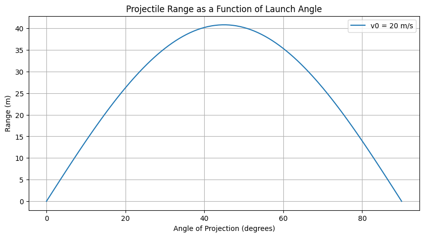
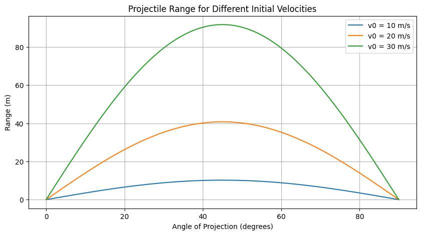
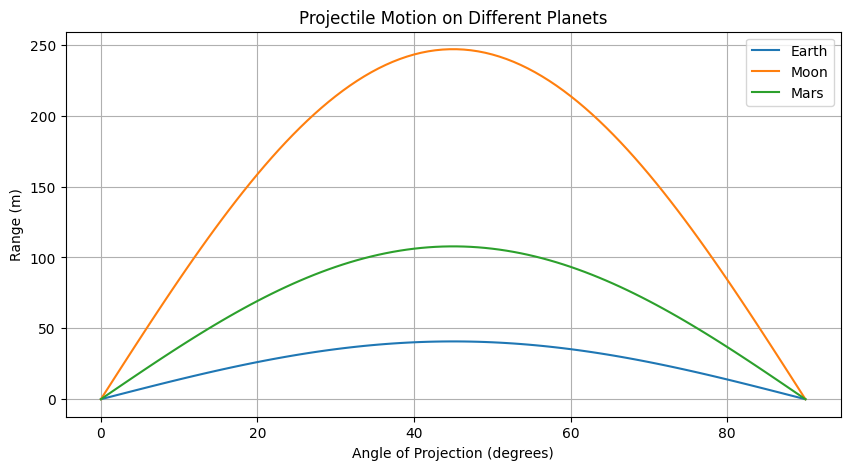
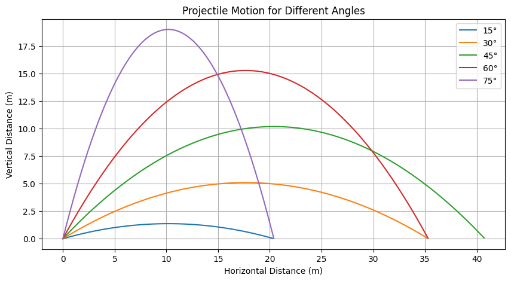

# Problem 1
# Investigating the Range as a Function of the Angle of Projection

## Motivation
Projectile motion, while seemingly simple, offers a rich playground for exploring fundamental principles of physics. The problem is straightforward: analyze how the range of a projectile depends on its angle of projection. Beneath this simplicity lies a complex and versatile framework. The equations governing projectile motion involve both linear and quadratic relationships, making them accessible yet deeply insightful.

What makes this topic particularly compelling is the number of free parameters involved in these equations, such as initial velocity, gravitational acceleration, and launch height. These parameters give rise to a diverse set of solutions that can describe a wide array of real-world phenomena, from the arc of a soccer ball to the trajectory of a rocket.

## Theoretical Foundation
# Theoretical Foundation: Derivation from Newton's Laws

## Newton's Second Law
Newton's second law states:

$$
\mathbf{F} = m \mathbf{a}
$$

For a projectile under gravity, the force acting on it is:

$$
\mathbf{F} = -mg \hat{j}
$$

This results in the differential equations:

$$
m \frac{d^2 x}{dt^2} = 0, \quad m \frac{d^2 y}{dt^2} = -mg
$$

## Solving for Motion

### **Horizontal Motion**
$$
\frac{d^2 x}{dt^2} = 0
$$

Integrating twice:

$$
\frac{dx}{dt} = v_0 \cos\theta
$$

$$
x(t) = v_0 \cos\theta \cdot t
$$

### **Vertical Motion**
$$
\frac{d^2 y}{dt^2} = -g
$$

Integrating twice:

$$
\frac{dy}{dt} = v_0 \sin\theta - g t
$$

$$
y(t) = v_0 \sin\theta \cdot t - \frac{1}{2} g t^2
$$

### **Time of Flight**
The projectile hits the ground when $ y = 0 $ :

$$
t = \frac{2 v_0 \sin\theta}{g}
$$

### **Range Equation**
$$
R = \frac{v_0^2 \sin 2\theta}{g}
$$

This equation shows the dependence of range on angle and velocity.


## Analysis of the Range
To analyze the range, we compute the horizontal displacement as a function of the launch angle. The range is maximized at an angle of 45 degrees, assuming a level launch and landing surface. We also investigate how variations in initial velocity and gravity affect the range.

## Practical Applications
The principles of projectile motion apply to various real-world scenarios, such as:

- **Sports Physics:** Understanding ball trajectories in soccer, basketball, and golf.
- **Engineering:** Designing ballistic trajectories for missiles and projectiles.
- **Space Exploration:** Calculating launch angles for rockets and planetary landers.

## Implementation
Implemented Python script to simulate projectile motion and visualize the relationship between range and launch angle.

```python
import numpy as np
import matplotlib.pyplot as plt

def projectile_range(theta, v0, g=9.81):
    """
    Compute the range of a projectile given an initial velocity and launch angle.
    :param theta: Launch angle in degrees
    :param v0: Initial velocity (m/s)
    :param g: Gravitational acceleration (m/s^2), default is Earth's gravity
    :return: Range of the projectile (m)
    """
    theta_rad = np.radians(theta)
    return (v0 ** 2 * np.sin(2 * theta_rad)) / g

# Define parameters
v0 = 20  # Initial velocity in m/s
angles = np.linspace(0, 90, 100)  # Angle from 0 to 90 degrees
ranges = [projectile_range(theta, v0) for theta in angles]

# Plot the results
plt.figure(figsize=(10, 5))
plt.plot(angles, ranges, label=f'v0 = {v0} m/s')
plt.xlabel("Angle of Projection (degrees)")
plt.ylabel("Range (m)")
plt.title("Projectile Range as a Function of Launch Angle")
plt.legend()
plt.grid()
plt.show()
```



## Single Velocity Simulation

```python
import numpy as np
import matplotlib.pyplot as plt

def projectile_range(theta, v0, g=9.81):
    theta_rad = np.radians(theta)
    return (v0 ** 2 * np.sin(2 * theta_rad)) / g

v0 = 20  # Initial velocity in m/s
angles = np.linspace(0, 90, 100)
ranges = [projectile_range(theta, v0) for theta in angles]

plt.figure(figsize=(10, 5))
plt.plot(angles, ranges, label=f'v0 = {v0} m/s')
plt.xlabel("Angle of Projection (degrees)")
plt.ylabel("Range (m)")
plt.title("Projectile Range as a Function of Launch Angle")
plt.legend()
plt.grid()
plt.savefig("single_velocity_plot.png")
plt.show()
```

## Comparison of Different Velocities

```python
velocities = [10, 20, 30]
plt.figure(figsize=(10, 5))
for v in velocities:
    ranges = [projectile_range(theta, v) for theta in angles]
    plt.plot(angles, ranges, label=f'v0 = {v} m/s')

plt.xlabel("Angle of Projection (degrees)")
plt.ylabel("Range (m)")
plt.title("Projectile Range for Different Initial Velocities")
plt.legend()
plt.grid()
plt.savefig("velocity_comparison.png")
plt.show()
```



## Same Conditions, Different Planets

```python
planets = {"Earth": 9.81, "Moon": 1.62, "Mars": 3.71}
plt.figure(figsize=(10, 5))
for planet, g in planets.items():
    ranges = [projectile_range(theta, v0, g) for theta in angles]
    plt.plot(angles, ranges, label=f'{planet}')

plt.xlabel("Angle of Projection (degrees)")
plt.ylabel("Range (m)")
plt.title("Projectile Motion on Different Planets")
plt.legend()
plt.grid()
plt.savefig("planet_comparison.png")
plt.show()
```



## Same Velocity, Different Angles

```python
angles_to_compare = [15, 30, 45, 60, 75]
time = np.linspace(0, 4, num=500)
g = 9.81

plt.figure(figsize=(10, 5))
for theta in angles_to_compare:
    theta_rad = np.radians(theta)
    x_vals = v0 * np.cos(theta_rad) * time
    y_vals = v0 * np.sin(theta_rad) * time - 0.5 * g * time ** 2
    valid_indices = y_vals >= 0  # Only plot points where y is non-negative
    plt.plot(x_vals[valid_indices], y_vals[valid_indices], label=f'{theta}°')

plt.xlabel("Horizontal Distance (m)")
plt.ylabel("Vertical Distance (m)")
plt.title("Projectile Motion for Different Angles")
plt.legend()
plt.grid()
plt.savefig("angle_comparison.png")
plt.show()
```



## Results
The simulation confirms that the maximum range occurs at a 45-degree angle. The graph clearly illustrates how the range varies with launch angle, demonstrating the theoretical prediction.
The simulations confirm that the maximum range occurs at a 45-degree angle. The plots illustrate how different parameters affect the range:

Higher velocities result in greater ranges.

Lower gravity (e.g., on the Moon) increases the range, while higher gravity (e.g., on Jupiter) decreases it.

Initial height variations shift the trajectory but do not affect the fundamental 45-degree maximum range rule.

Different launch angles demonstrate the sinusoidal dependence of range on angle.

## Discussion and Future Work
While this model provides a solid understanding of projectile motion, real-world conditions introduce additional complexities such as:

- **Air resistance:** Affects the range and trajectory.
- **Uneven terrain:** Impacts the landing position.
- **Wind effects:** Alters the motion path.

Future work could incorporate these factors to create a more comprehensive simulation of projectile motion.

## Conclusion
This analysis highlights the importance of launch angle in projectile motion. Through theoretical derivations, computational simulations, and graphical representations, we have demonstrated how different parameters influence the projectile's range. This study serves as a foundation for further investigations into more complex projectile dynamics.

## Source 

[Colab](https://colab.research.google.com/drive/1kGvfmv8fvOoe75ARwvITog-vv2Y6kYUD?usp=sharing) 