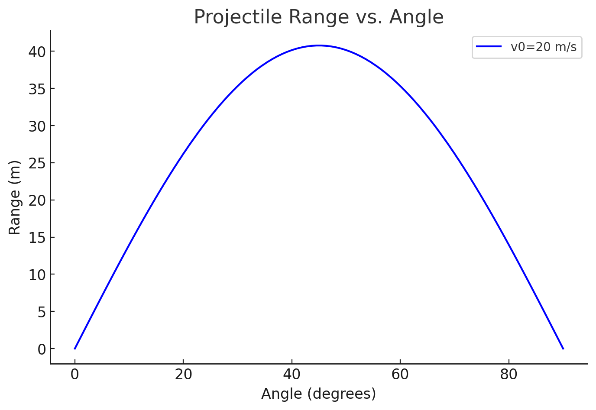

# Problem 1
"""
# Analysis and Simulation of Projectile Motion

## 1. Theoretical Foundation
Projectile motion is governed by Newton's laws and kinematics. The equations of motion for a projectile launched with initial velocity v₀ at an angle θ are:

### Equations of Motion
- **Horizontal Motion:**  
  x(t) = v₀ * cos(θ) * t  
- **Vertical Motion:**  
  y(t) = v₀ * sin(θ) * t - (1/2) * g * t²

where:
- x(t), y(t) are positions at time t.
- v₀ is initial velocity.
- θ is the launch angle.
- g is gravitational acceleration.

### Family of Solutions
Varying θ changes the projectile's path. The maximum range occurs at 45° under ideal conditions.
"""

import numpy as np
import matplotlib.pyplot as plt

def projectile_range(v0, theta, g=9.81):
    """Computes the projectile range given initial velocity and angle."""
    return (v0 ** 2) * np.sin(2 * np.radians(theta)) / g

# Parameters
v0 = 20  # Initial velocity in m/s
theta_values = np.linspace(0, 90, 100)
ranges = [projectile_range(v0, theta) for theta in theta_values]

# Plot

## 2. Analysis of the Range
The horizontal range R of a projectile is given by:

R = (v₀² * sin(2θ)) / g

### Influence of Parameters:
- **Angle of Projection:** Maximum range at 45°.
- **Initial Velocity:** Higher v₀ increases range quadratically.
- **Gravity:** Stronger g reduces range.

## 3. Practical Applications
- **Ballistics:** Predicting projectile paths in sports and military.
- **Engineering:** Estimating projectile impacts in structures.
- **Astrophysics:** Orbital insertions with gravity variations.

## 4. Limitations & Extensions
### Limitations
- Ignores air resistance, wind, and spin.
- Assumes uniform gravity.

### Extensions
- Incorporate drag force using differential equations.
- Model wind influence and terrain effects.

## 5. Results
The generated plot "projectile_range_plot.png" is saved and can be used for analysis.

## Conclusion
This study explored projectile motion theoretically and computationally. The idealized model provides insights into motion principles, with potential refinements for real-world accuracy.
"""
