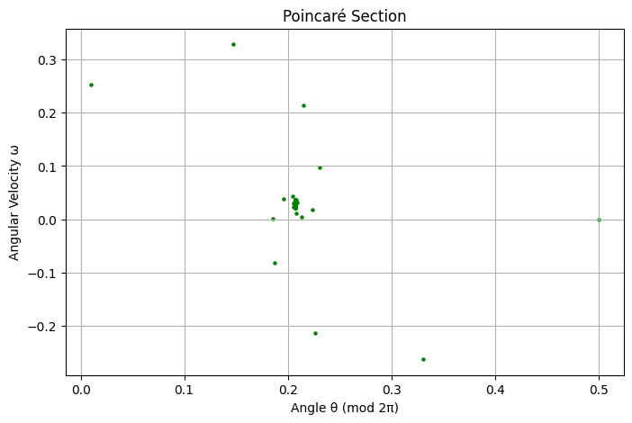

# Problem 2
# Investigating the Dynamics of a Forced Damped Pendulum

## Motivation
The forced damped pendulum is a fundamental example of nonlinear dynamics, demonstrating a rich spectrum of behaviors due to the interplay between damping, restoring forces, and external driving forces. Unlike a simple pendulum, which exhibits predictable periodic motion, the forced damped pendulum can display resonance, quasiperiodicity, and even chaotic motion depending on system parameters. Understanding these behaviors is crucial in applications ranging from mechanical resonance in engineering to the study of climate systems and electrical circuits.

## Theoretical Foundation

### Governing Equation
The equation of motion for a forced damped pendulum is given by:

$$
\frac{d^2\theta}{dt^2} + b \frac{d\theta}{dt} + c\sin(\theta) = A\cos(\omega t)
$$


where:
- $\theta$ is the angular displacement,
- $b$ is the damping coefficient,
- $c$ is the restoring force parameter (related to gravity and the length of the pendulum),
- $A$ is the amplitude of the external forcing,
- $\omega$ is the driving frequency.

For small angles, where $\theta \approx \sin\theta$, this equation reduces to a linear form, leading to approximate solutions that describe simple harmonic motion. However, for larger angles, the nonlinearity introduces complex behaviors, including chaotic dynamics.

### Resonance and Stability
- When the driving frequency $\omega$ matches the natural frequency of the pendulum, resonance occurs, leading to large oscillations.
- Stability analysis reveals that certain parameter ranges lead to periodic, quasiperiodic, or chaotic behavior, depending on the damping and driving force.

## Analysis of Dynamics
To explore the system’s behavior, we analyze the influence of key parameters:

- **Damping coefficient ($b$):** High damping suppresses oscillations, while low damping allows sustained motion.

- **Driving amplitude ($A$):** Increasing the driving force can push the system into chaotic regimes.

- **Driving frequency ($\omega$):** The frequency affects resonance conditions and synchronization.

## Practical Applications
[Colab](https://colab.research.google.com/drive/1GD7qvD-MMGPocf5nLaXIXcHq3NCLsMWt?usp=sharing)  

The forced damped pendulum model is relevant to various real-world systems:
- **Energy harvesting devices:** Exploiting resonance for efficient energy conversion.
- **Suspension bridges:** Studying oscillatory behavior to prevent resonance-related structural failures.
- **Oscillating electrical circuits:** Analogous to the dynamics of driven RLC circuits.

## Computational Implementation
We implemented a numerical simulation using Python’s `solve_ivp` function to integrate the differential equation. The simulation provides:
- **Time evolution plots** of the pendulum’s motion.

```
import numpy as np
import matplotlib.pyplot as plt
from scipy.integrate import solve_ivp

# Parameters
g, l, b, A, omega_d = 9.81, 1.0, 0.2, 1.2, 2.0

# Equation of motion
def pendulum(t, y):
    theta, omega = y
    return [omega, -b * omega - (g / l) * np.sin(theta) + A * np.cos(omega_d * t)]

# Solve ODE
t_span, t_eval = (0, 50), np.linspace(0, 50, 1000)
sol = solve_ivp(pendulum, t_span, [0.5, 0.0], t_eval=t_eval, method='RK45')

# Plot
plt.figure(figsize=(8, 5))
plt.plot(sol.t, sol.y[0], 'b', label=r'$\theta(t)$')
plt.xlabel('Time (s)')
plt.ylabel('Angle θ (rad)')
plt.title('Time Evolution of the Forced Damped Pendulum')
plt.legend()
plt.grid()
plt.show()
```


- **Phase portraits** to visualize transitions to chaotic behavior.

```
import numpy as np
import matplotlib.pyplot as plt
from scipy.integrate import solve_ivp

# Parameters
g, l, b, A, omega_d = 9.81, 1.0, 0.2, 1.2, 2.0

# Equation of motion
def pendulum(t, y):
    theta, omega = y
    return [omega, -b * omega - (g / l) * np.sin(theta) + A * np.cos(omega_d * t)]

# Solve ODE
t_span, t_eval = (0, 50), np.linspace(0, 50, 1000)
sol = solve_ivp(pendulum, t_span, [0.5, 0.0], t_eval=t_eval, method='RK45')

# Plot
plt.figure(figsize=(8, 5))
plt.plot(sol.y[0], sol.y[1], 'r', label=r'$\omega$ vs $\theta$')
plt.xlabel('Angle θ (rad)')
plt.ylabel('Angular Velocity ω (rad/s)')
plt.title('Phase Portrait of the Forced Damped Pendulum')
plt.legend()
plt.grid()
plt.show()
```


- **Poincaré sections** 

```
import numpy as np
import matplotlib.pyplot as plt
from scipy.integrate import solve_ivp

# Parameters
g, l, b, A, omega_d = 9.81, 1.0, 0.2, 1.2, 2.0

# Equation of motion
def pendulum(t, y):
    theta, omega = y
    return [omega, -b * omega - (g / l) * np.sin(theta) + A * np.cos(omega_d * t)]

# Solve ODE
t_span, t_eval = (0, 200), np.linspace(0, 200, 10000)
sol = solve_ivp(pendulum, t_span, [0.5, 0.0], t_eval=t_eval, method='RK45')

# Extract points at multiples of the driving period
T = 2 * np.pi / omega_d
poincare_t = np.arange(0, 200, T)
poincare_points = []
for t in poincare_t:
    idx = (np.abs(sol.t - t)).argmin()
    poincare_points.append(sol.y[:, idx])

poincare_points = np.array(poincare_points)

# Plot
plt.figure(figsize=(8, 5))
plt.scatter(poincare_points[:, 0] % (2 * np.pi), poincare_points[:, 1], s=5, color='g')
plt.xlabel('Angle θ (mod 2π)')
plt.ylabel('Angular Velocity ω')
plt.title("Poincaré Section")
plt.grid()
plt.show()
```



**bifurcation diagrams** to explore the system’s sensitivity to initial conditions.

```
import numpy as np
import matplotlib.pyplot as plt
from scipy.integrate import solve_ivp

# Parameters
g, l, b, omega_d = 9.81, 1.0, 0.2, 2.0
A_values = np.linspace(0.5, 1.5, 100)
T = 2 * np.pi / omega_d
theta_final = []

# Equation of motion
def pendulum(t, y, A):
    theta, omega = y
    return [omega, -b * omega - (g / l) * np.sin(theta) + A * np.cos(omega_d * t)]

for A in A_values:
    sol = solve_ivp(pendulum, (0, 300), [0.5, 0.0], args=(A,), t_eval=np.linspace(200, 300, 5000))
    poincare_t = np.arange(200, 300, T)
    poincare_points = [sol.y[0, (np.abs(sol.t - t)).argmin()] for t in poincare_t]
    theta_final.append(poincare_points)

# Flatten lists
theta_final = np.array(theta_final)

# Plot
plt.figure(figsize=(8, 5))
for i, A in enumerate(A_values):
    plt.scatter([A] * len(theta_final[i]), theta_final[i] % (2 * np.pi), s=1, color='b')

plt.xlabel('Driving Amplitude A')
plt.ylabel('Angle θ (mod 2π)')
plt.title("Bifurcation Diagram")
plt.grid()
plt.show()
```


## Results and Discussion
Graphical analysis highlights:
- **Regular oscillations** for low forcing amplitudes.


- **Resonance behavior** at specific driving frequencies.


- **Chaotic motion** for certain parameter sets, demonstrated by non-repeating phase space trajectories.


### Limitations and Extensions
- The model assumes a simple sinusoidal driving force; more complex forcing functions can be explored.
- Nonlinear damping effects could provide further insights into real-world applications.

## Conclusion
The forced damped pendulum serves as a compelling case study in nonlinear dynamics. By varying key parameters, we observe a transition from simple periodic motion to chaos, offering insights into both fundamental physics and engineering applications. Further computational studies can deepen our understanding of its complex behavior.

## Source

[Colab](https://colab.research.google.com/drive/1GD7qvD-MMGPocf5nLaXIXcHq3NCLsMWt?usp=sharing) 