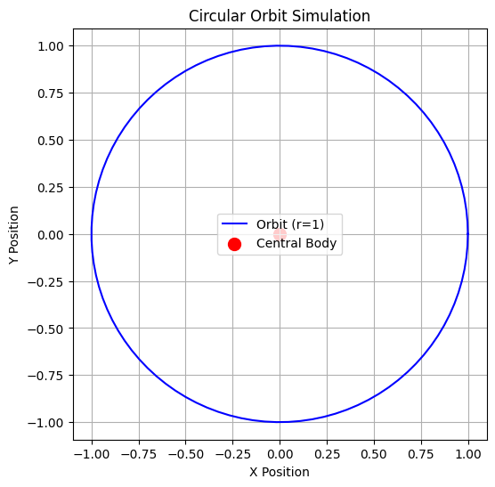
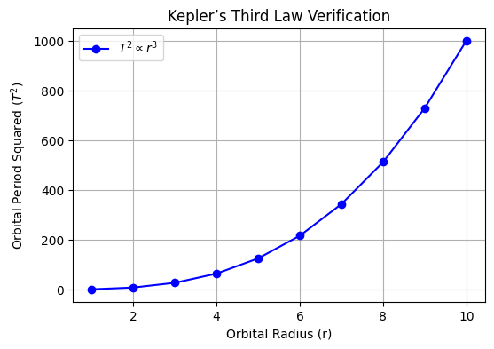

# Problem 1

### **Gravity: Orbital Period and Orbital Radius**

#### **Motivation**
Kepler’s Third Law states that the square of the orbital period ($T^2$) is proportional to the cube of the orbital radius ($r^3$). This fundamental relationship provides critical insights into celestial mechanics, governing planetary orbits, satellite motion, and gravitational interactions on both small and cosmic scales. Understanding this law allows astronomers to determine planetary masses, calculate distances in space, and analyze the stability of orbits.

---

### **Derivation of Kepler's Third Law**
For a body in a circular orbit around a massive central body (e.g., a planet orbiting a star), the centripetal force required to maintain the orbit is provided by gravitational attraction:

$$
F_{\text{gravity}} = F_{\text{centripetal}}
$$

$$
\frac{G M m}{r^2} = \frac{m v^2}{r}
$$

Since the orbital velocity $v$ is related to the period $T$ by:

$$
v = \frac{2\pi r}{T}
$$

Substituting this into the equation:

$$
\frac{G M m}{r^2} = \frac{m (2\pi r)^2}{T^2 r}
$$

Canceling $m$ and simplifying:

$$
\frac{G M}{r^2} = \frac{4\pi^2 r}{T^2}
$$

Rearranging:

$$
T^2 = \frac{4\pi^2}{G M} r^3
$$

This confirms that $T^2 \propto r^3$, meaning the square of the orbital period is proportional to the cube of the orbital radius.

---

### **Implications in Astronomy**
- **Planetary Mass Calculation:** Given the orbital period and radius of a planet's moon, one can estimate the planet’s mass using Kepler’s Law.
- **Solar System Analysis:** The law allows astronomers to determine distances between planets and their stars even without direct measurements.
- **Satellite Orbits:** Understanding this relationship helps in designing stable satellite trajectories for communication and observation.
- **Exoplanet Detection:** By measuring periodic changes in a star’s brightness due to transiting planets, scientists can infer planetary orbits.

---

### **Real-World Examples**
#### **1. The Moon’s Orbit Around Earth**
- The Moon orbits Earth at an average radius of $3.84 \times 10^5$ km with a period of 27.3 days.
- Using Kepler’s Law, we can estimate Earth's mass and verify astronomical models.

#### **2. The Solar System**
- The orbits of planets around the Sun follow Kepler’s Third Law, with larger orbits corresponding to longer periods.
- For example:
  - **Earth:** $r = 1$ AU, $T = 1$ year
  - **Mars:** $r \approx 1.52$ AU, $T \approx 1.88$ years
  - **Jupiter:** $r \approx 5.2$ AU, $T \approx 11.86$ years

---

### **Computational Simulation**
To visualize the orbital relationship, we employ Python simulations:

1. **Circular Orbit Simulation:** 
   - Generates a circular path for an orbiting body.
   - Marks the central mass.

```python
import numpy as np
import matplotlib.pyplot as plt

def plot_orbit(radius):
    # Generate circular path
    theta = np.linspace(0, 2 * np.pi, 100)
    x = radius * np.cos(theta)
    y = radius * np.sin(theta)

    # Plot the orbit
    plt.figure(figsize=(6, 6))
    plt.plot(x, y, label=f'Orbit (r={radius})', color='blue')
    plt.scatter(0, 0, color='red', label='Central Body', s=100)  # Central mass
    plt.xlabel('X Position')
    plt.ylabel('Y Position')
    plt.legend()
    plt.grid()
    plt.title('Circular Orbit Simulation')
    plt.axis('equal')  # Ensure the orbit is a perfect circle
    plt.show()

# Call the function with a radius of 1
plot_orbit(1)
import numpy as np
import matplotlib.pyplot as plt

# Define orbital radii (arbitrary units)
radii = np.linspace(1, 10, 10)  

# Calculate orbital periods using Kepler's Third Law (assuming G*M = 1 for simplicity)
periods = np.sqrt(radii**3)  

# Plot the relationship
plt.figure(figsize=(6, 4))
plt.plot(radii, periods**2, 'bo-', label=r'$T^2 \propto r^3$')  # Plot T^2 vs. r^3
plt.xlabel('Orbital Radius (r)')
plt.ylabel('Orbital Period Squared ($T^2$)')
plt.legend()
plt.grid()
plt.title("Kepler’s Third Law Verification")
plt.show()
```



2. **Graph of Kepler’s Law:** 
   - Plots orbital radius vs. orbital period squared.
   - Demonstrates the $T^2 \propto r^3$ relationship.

```python
import numpy as np
import matplotlib.pyplot as plt

# Define orbital radii (arbitrary units)
radii = np.linspace(1, 10, 10)  

# Calculate orbital periods using Kepler's Third Law (assuming G*M = 1 for simplicity)
periods = np.sqrt(radii**3)  

# Plot the relationship
plt.figure(figsize=(6, 4))
plt.plot(radii, periods**2, 'bo-', label=r'$T^2 \propto r^3$')  # Plot T^2 vs. r^3
plt.xlabel('Orbital Radius (r)')
plt.ylabel('Orbital Period Squared ($T^2$)')
plt.legend()
plt.grid()
plt.title("Kepler’s Third Law Verification")
plt.show()
```



3. **Animated Orbit Visualization:** 
   - Creates a dynamic representation of an object moving in a circular orbit.
   - Helps in understanding real-time orbital mechanics.

[Colab](https://colab.research.google.com/drive/1icEuLRckKuaCduUnGgaJcfvencpriOC_?usp=sharing)

---

### **Extension to Elliptical Orbits**
While Kepler’s Third Law is derived for circular orbits, it holds for elliptical orbits as well, with the semi-major axis $a$ replacing the orbital radius $r$:

$$
T^2 \propto a^3
$$

This extends the application of the law to non-circular celestial bodies, including exoplanets, binary star systems, and asteroids.

---

### **Conclusion**
Kepler’s Third Law serves as a powerful tool in celestial mechanics, linking orbital periods and radii in a predictable manner. By leveraging computational models and real-world observations, scientists continue to explore planetary systems, enhance satellite technology, and unravel the mysteries of the universe.