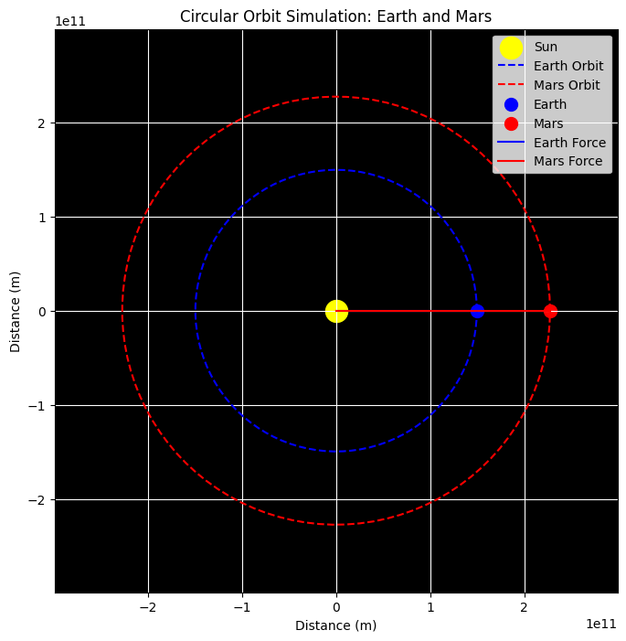
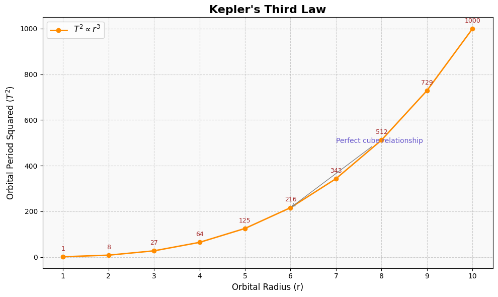

# Problem 1

### **Gravity: Orbital Period and Orbital Radius**

#### **Motivation**
Kepler’s Third Law states that the square of the orbital period ($T^2$) is proportional to the cube of the orbital radius ($r^3$). This fundamental relationship provides critical insights into celestial mechanics, governing planetary orbits, satellite motion, and gravitational interactions on both small and cosmic scales. Understanding this law allows astronomers to determine planetary masses, calculate distances in space, and analyze the stability of orbits.

---

### **Derivation of Kepler's Third Law**
For a body in a circular orbit around a massive central body (e.g., a planet orbiting a star), the centripetal force required to maintain the orbit is provided by gravitational attraction:

$$
F_{\text{gravity}} = F_{\text{centripetal}}
$$

$$
\frac{G M m}{r^2} = \frac{m v^2}{r}
$$

Since the orbital velocity $v$ is related to the period $T$ by:

$$
v = \frac{2\pi r}{T}
$$

Substituting this into the equation:

$$
\frac{G M m}{r^2} = \frac{m (2\pi r)^2}{T^2 r}
$$

Canceling $m$ and simplifying:

$$
\frac{G M}{r^2} = \frac{4\pi^2 r}{T^2}
$$

Rearranging:

$$
T^2 = \frac{4\pi^2}{G M} r^3
$$

This confirms that $T^2 \propto r^3$, meaning the square of the orbital period is proportional to the cube of the orbital radius.

---

### **Implications in Astronomy**
- **Planetary Mass Calculation:** Given the orbital period and radius of a planet's moon, one can estimate the planet’s mass using Kepler’s Law.
- **Solar System Analysis:** The law allows astronomers to determine distances between planets and their stars even without direct measurements.
- **Satellite Orbits:** Understanding this relationship helps in designing stable satellite trajectories for communication and observation.
- **Exoplanet Detection:** By measuring periodic changes in a star’s brightness due to transiting planets, scientists can infer planetary orbits.

---

### **Real-World Examples**
#### **1. The Moon’s Orbit Around Earth**
- The Moon orbits Earth at an average radius of $3.84 \times 10^5$ km with a period of 27.3 days.
- Using Kepler’s Law, we can estimate Earth's mass and verify astronomical models.

#### **2. The Solar System**
- The orbits of planets around the Sun follow Kepler’s Third Law, with larger orbits corresponding to longer periods.
- For example:
  - **Earth:** $r = 1$ AU, $T = 1$ year
  - **Mars:** $r \approx 1.52$ AU, $T \approx 1.88$ years
  - **Jupiter:** $r \approx 5.2$ AU, $T \approx 11.86$ years

---

### **Computational Simulation**
To visualize the orbital relationship, we employ Python simulations:

1. **Circular Orbit Simulation:** 
   - Generates a circular path for an orbiting body.
   - Marks the central mass.

```python
import numpy as np
import matplotlib.pyplot as plt

# Constants
AU = 1.496e11  # Astronomical Unit (m)
G = 6.67430e-11  # Gravitational constant (m^3 kg^-1 s^-2)
M_sun = 1.989e30  # Mass of the Sun (kg)

# Orbital parameters
radii = [1 * AU, 1.52 * AU]  # Earth and Mars distances from the Sun in meters
masses = [5.972e24, 6.4171e23]  # Earth and Mars masses (kg)

# Orbital velocities (using circular orbit velocity formula: v = sqrt(G*M/r))
v_earth = np.sqrt(G * M_sun / radii[0])
v_mars = np.sqrt(G * M_sun / radii[1])

# Set up the figure
fig, ax = plt.subplots(figsize=(8, 8))
ax.set_xlim(-2 * AU, 2 * AU)
ax.set_ylim(-2 * AU, 2 * AU)
ax.set_aspect('equal')
ax.set_facecolor('black')

# Create the central Sun (stationary at the center)
sun = plt.scatter(0, 0, color='yellow', s=300, label='Sun')

# Plot the orbits (circular for simplicity)
theta = np.linspace(0, 2 * np.pi, 100)
orbit_earth_x = radii[0] * np.cos(theta)
orbit_earth_y = radii[0] * np.sin(theta)
orbit_mars_x = radii[1] * np.cos(theta)
orbit_mars_y = radii[1] * np.sin(theta)

ax.plot(orbit_earth_x, orbit_earth_y, 'b--', label="Earth Orbit")
ax.plot(orbit_mars_x, orbit_mars_y, 'r--', label="Mars Orbit")

# Position of the planets (simulating at t=0)
x_earth = radii[0]
y_earth = 0
x_mars = radii[1]
y_mars = 0

# Plot the planets (Earth and Mars)
ax.scatter(x_earth, y_earth, color='blue', s=100, label="Earth")
ax.scatter(x_mars, y_mars, color='red', s=100, label="Mars")

# Velocity vectors (tangent to the orbit)
ax.arrow(x_earth, y_earth, -0.1 * v_earth * np.sin(0), 0.1 * v_earth * np.cos(0),
         head_width=0.05 * v_earth, head_length=0.1 * v_earth, fc='blue', ec='blue')
ax.arrow(x_mars, y_mars, -0.1 * v_mars * np.sin(0), 0.1 * v_mars * np.cos(0),
         head_width=0.05 * v_mars, head_length=0.1 * v_mars, fc='red', ec='red')

# Gravitational force vectors (towards the Sun)
ax.plot([x_earth, 0], [y_earth, 0], 'b-', label="Earth Force")
ax.plot([x_mars, 0], [y_mars, 0], 'r-', label="Mars Force")

# Add labels and title
ax.set_title("Circular Orbit Simulation: Earth and Mars")
ax.set_xlabel("Distance (m)")
ax.set_ylabel("Distance (m)")
ax.legend()
ax.grid(True, color='white')

# Show the plot
plt.show()
```



2. **Graph of Kepler’s Law:** 
   - Plots orbital radius vs. orbital period squared.
   - Demonstrates the $T^2 \propto r^3$ relationship.

```python
import matplotlib.pyplot as plt
import numpy as np

# Data: Orbital radius (r) and T² ∝ r³
r = np.arange(1, 11)
T_squared = r**3  # Kepler's Third Law: T² ∝ r³

# Plotting
plt.figure(figsize=(10, 6))
plt.plot(r, T_squared, marker='o', linestyle='-', linewidth=2, color='darkorange', label=r'$T^2 \propto r^3$')

# Clean and clear title
plt.title("Kepler's Third Law", fontsize=16, fontweight='bold')
plt.xlabel("Orbital Radius (r)", fontsize=12)
plt.ylabel(r"Orbital Period Squared ($T^2$)", fontsize=12)

# Grid and background styling
plt.grid(True, linestyle='--', alpha=0.6)
plt.gca().set_facecolor('#f9f9f9')
plt.xticks(r, fontsize=10)
plt.yticks(fontsize=10)

# Annotating the data points with their T² values
for i in r:
    plt.text(i, i**3 + 20, f"{i**3}", ha='center', va='bottom', fontsize=9, color='brown')

# Add a helpful annotation
plt.annotate("Perfect cube relationship", xy=(6, 216), xytext=(7, 500),
             arrowprops=dict(arrowstyle="->", color='gray'),
             fontsize=10, color='slateblue')

# Legend and layout
plt.legend(fontsize=12)
plt.tight_layout()
plt.show()
```



3. **Animated Orbit Visualization:** 
   - Creates a dynamic representation of an object moving in a circular orbit.
   - Helps in understanding real-time orbital mechanics.

[Colab](https://colab.research.google.com/drive/1icEuLRckKuaCduUnGgaJcfvencpriOC_?usp=sharing)

---

### **Extension to Elliptical Orbits**
While Kepler’s Third Law is derived for circular orbits, it holds for elliptical orbits as well, with the semi-major axis $a$ replacing the orbital radius $r$:

$$
T^2 \propto a^3
$$

This extends the application of the law to non-circular celestial bodies, including exoplanets, binary star systems, and asteroids.

---

### **Conclusion**
Kepler’s Third Law serves as a powerful tool in celestial mechanics, linking orbital periods and radii in a predictable manner. By leveraging computational models and real-world observations, scientists continue to explore planetary systems, enhance satellite technology, and unravel the mysteries of the universe.