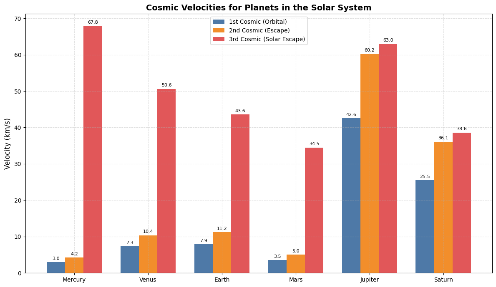

# Problem 2
# Escape Velocities and Cosmic Velocities

## Motivation

Understanding escape velocity and cosmic velocities is essential for grasping how spacecraft overcome gravitational pull and reach space. These velocities govern not only satellite launches but also interplanetary and interstellar missions. The first, second, and third cosmic velocities define the key thresholds for:
- Staying in orbit (1st),
- Escaping a planet (2nd),
- Escaping a star system (3rd).

---

## 1. Cosmic Velocities Defined

### First Cosmic Velocity (Orbital Velocity)

The minimum speed required to orbit a planet just above its surface without propulsion.
$$
v_1 = \sqrt{\frac{GM}{R}}
$$

### Second Cosmic Velocity (Escape Velocity)

The minimum speed needed to break free from a planet's gravitational pull.
$$
v_2 = \sqrt{2}\cdot v_1 = \sqrt{\frac{2GM}{R}}
$$

### Third Cosmic Velocity (Interstellar Escape)

The speed required to escape a star system (e.g., the Sun’s gravity from Earth’s orbit).
$$
v_3 = \sqrt{v_{escape,planet}^2 + v_{escape,star}^2}
$$

---

## 2. Derivation and Parameters

- **G** = Universal Gravitational Constant $$ \approx 6.674 \times 10^{-11} \, \text{Nm}^2/\text{kg}^2 $$
- **M** = Mass of the celestial body
- **R** = Radius from the center of the celestial body

These velocities increase with the mass of the body and decrease with distance.

---

## 3. Python Code and Visualization

```python
import numpy as np
import matplotlib.pyplot as plt

# === Constants ===
G = 6.67430e-11  # gravitational constant (m^3 kg^-1 s^-2)
SUN_MASS = 1.989e30  # mass of the Sun (kg)

# === Planetary data: mass (kg), radius (m), average distance from Sun (m) ===
bodies = {
    'Mercury': {'mass': 3.301e23, 'radius': 2.4397e6, 'sun_dist': 5.791e10},
    'Venus':   {'mass': 4.867e24, 'radius': 6.0518e6, 'sun_dist': 1.082e11},
    'Earth':   {'mass': 5.972e24, 'radius': 6.371e6,  'sun_dist': 1.496e11},
    'Mars':    {'mass': 6.39e23,  'radius': 3.3895e6, 'sun_dist': 2.279e11},
    'Jupiter': {'mass': 1.898e27, 'radius': 6.9911e7, 'sun_dist': 7.785e11},
    'Saturn':  {'mass': 5.683e26, 'radius': 5.8232e7, 'sun_dist': 1.433e12}
}

# === Velocity calculations ===
def compute_cosmic_velocities(planet_mass, planet_radius, dist_to_sun):
    """
    Compute the three main cosmic velocities:
    - v1: Orbital velocity around planet (1st cosmic velocity)
    - v2: Escape velocity from planet (2nd cosmic velocity)
    - v3: Escape velocity from the solar system at planet's orbit (3rd cosmic velocity)
    Returns velocities in km/s.
    """
    v1 = np.sqrt(G * planet_mass / planet_radius)  # 1st cosmic
    v2 = np.sqrt(2 * G * planet_mass / planet_radius)  # 2nd cosmic
    v_sun_escape = np.sqrt(2 * G * SUN_MASS / dist_to_sun)  # solar system escape
    v3 = np.sqrt(v2**2 + v_sun_escape**2)  # 3rd cosmic (combined escape)
    
    return v1 / 1000, v2 / 1000, v3 / 1000  # Convert to km/s

# === Data processing ===
results = {
    planet: compute_cosmic_velocities(data['mass'], data['radius'], data['sun_dist'])
    for planet, data in bodies.items()
}

# === Plotting data ===
labels = list(results.keys())
v1_vals = [results[p][0] for p in labels]
v2_vals = [results[p][1] for p in labels]
v3_vals = [results[p][2] for p in labels]

x = np.arange(len(labels))
bar_width = 0.25

# === Plotting ===
plt.figure(figsize=(12, 7))
colors = ['#4e79a7', '#f28e2b', '#e15759']

bars1 = plt.bar(x - bar_width, v1_vals, width=bar_width, label='1st Cosmic (Orbital)', color=colors[0])
bars2 = plt.bar(x, v2_vals, width=bar_width, label='2nd Cosmic (Escape)', color=colors[1])
bars3 = plt.bar(x + bar_width, v3_vals, width=bar_width, label='3rd Cosmic (Solar Escape)', color=colors[2])

# === Annotate bar values ===
for bar_group in [bars1, bars2, bars3]:
    for bar in bar_group:
        height = bar.get_height()
        plt.text(bar.get_x() + bar.get_width() / 2, height + 0.4, f"{height:.1f}", 
                 ha='center', va='bottom', fontsize=8)

# === Plot settings ===
plt.xticks(x, labels, fontsize=10)
plt.ylabel("Velocity (km/s)", fontsize=12)
plt.title("Cosmic Velocities for Planets in the Solar System", fontsize=14, fontweight='bold')
plt.legend()
plt.grid(True, linestyle='--', alpha=0.4)
plt.tight_layout()
plt.show()
```




[Colab](https://colab.research.google.com/drive/1henoSqpYu-a0p3l-9qrtfosVHDtWK3pq?usp=sharing)


---

## 4. Discussion and Importance in Space Exploration

### First Cosmic Velocity
- Enables satellites to orbit Earth or other planets.
- Used in designing stable, fuel-efficient orbits for communication, navigation, and observation.

### Second Cosmic Velocity
- Critical for launching missions beyond Earth (e.g., Mars rovers).
- Requires powerful boosters like the Saturn V or SLS.

### Third Cosmic Velocity
- Needed for escaping the Sun’s gravitational field.
- Applied in deep space missions (e.g., Voyager, New Horizons).
- Achievable with gravity assists or long-duration ion drives.

---

## Conclusion

The concept of cosmic velocities illustrates the increasing energy requirements for moving from orbit to planetary escape to interstellar travel. These velocities are fundamental in space mission planning and dictate the technology and fuel necessary for different levels of exploration. As we aim for Mars and beyond, mastering these speeds becomes ever more crucial.