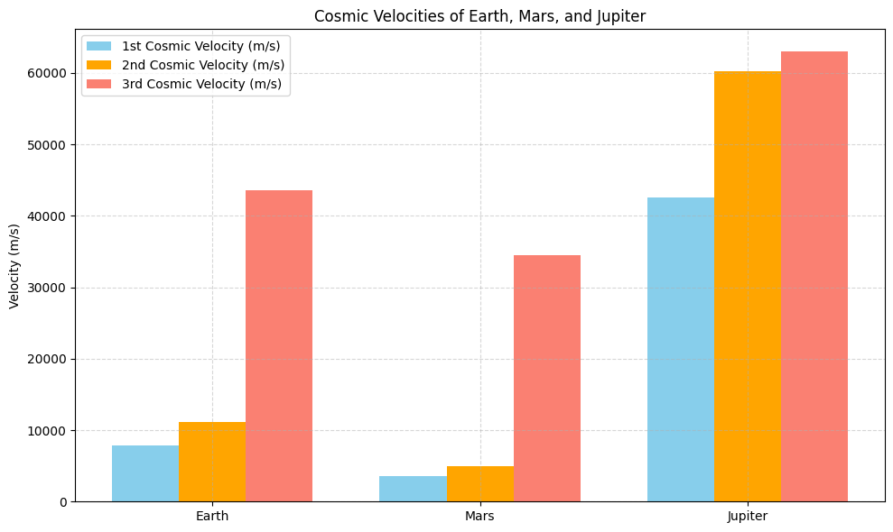

# Problem 2
# Escape Velocities and Cosmic Velocities

## Motivation

Understanding escape velocity and cosmic velocities is essential for grasping how spacecraft overcome gravitational pull and reach space. These velocities govern not only satellite launches but also interplanetary and interstellar missions. The first, second, and third cosmic velocities define the key thresholds for:
- Staying in orbit (1st),
- Escaping a planet (2nd),
- Escaping a star system (3rd).

---

## 1. Cosmic Velocities Defined

### First Cosmic Velocity (Orbital Velocity)

The minimum speed required to orbit a planet just above its surface without propulsion.
$$
v_1 = \sqrt{\frac{GM}{R}}
$$

### Second Cosmic Velocity (Escape Velocity)

The minimum speed needed to break free from a planet's gravitational pull.
$$
v_2 = \sqrt{2}\cdot v_1 = \sqrt{\frac{2GM}{R}}
$$

### Third Cosmic Velocity (Interstellar Escape)

The speed required to escape a star system (e.g., the Sun’s gravity from Earth’s orbit).
$$
v_3 = \sqrt{v_{escape,planet}^2 + v_{escape,star}^2}
$$

---

## 2. Derivation and Parameters

- **G** = Universal Gravitational Constant $$ \approx 6.674 \times 10^{-11} \, \text{Nm}^2/\text{kg}^2 $$
- **M** = Mass of the celestial body
- **R** = Radius from the center of the celestial body

These velocities increase with the mass of the body and decrease with distance.

---

## 3. Python Code and Visualization

```python
import numpy as np
import matplotlib.pyplot as plt

# Constants
G = 6.67430e-11  # gravitational constant, m^3 kg^-1 s^-2

# Celestial bodies data: name, mass (kg), radius (m)
bodies = {
    'Earth': {'mass': 5.972e24, 'radius': 6.371e6},
    'Mars': {'mass': 6.39e23, 'radius': 3.3895e6},
    'Jupiter': {'mass': 1.898e27, 'radius': 6.9911e7}
}

# Sun's data for 3rd cosmic velocity (for escaping the solar system)
sun_mass = 1.989e30
sun_distance = {
    'Earth': 1.496e11,
    'Mars': 2.279e11,
    'Jupiter': 7.785e11
}

# Function to compute velocities
def compute_velocities(mass, radius, sun_dist):
    v1 = np.sqrt(G * mass / radius)
    v2 = np.sqrt(2 * G * mass / radius)
    v_star_escape = np.sqrt(2 * G * sun_mass / sun_dist)
    v3 = np.sqrt(v2**2 + v_star_escape**2)
    return v1, v2, v3

# Store results
results = {}
for body in bodies:
    m = bodies[body]['mass']
    r = bodies[body]['radius']
    d = sun_distance[body]
    results[body] = compute_velocities(m, r, d)

# Plotting
labels = list(results.keys())
v1_vals = [results[b][0] for b in labels]
v2_vals = [results[b][1] for b in labels]
v3_vals = [results[b][2] for b in labels]

x = np.arange(len(labels))
width = 0.25

plt.figure(figsize=(10, 6))
plt.bar(x - width, v1_vals, width=width, label='1st Cosmic Velocity (m/s)', color='skyblue')
plt.bar(x, v2_vals, width=width, label='2nd Cosmic Velocity (m/s)', color='orange')
plt.bar(x + width, v3_vals, width=width, label='3rd Cosmic Velocity (m/s)', color='salmon')
plt.xticks(x, labels)
plt.ylabel("Velocity (m/s)")
plt.title("Cosmic Velocities of Earth, Mars, and Jupiter")
plt.legend()
plt.grid(True, linestyle='--', alpha=0.5)
plt.tight_layout()
plt.show()
```




[Colab](https://colab.research.google.com/drive/1henoSqpYu-a0p3l-9qrtfosVHDtWK3pq?usp=sharing)


---

## 4. Discussion and Importance in Space Exploration

### First Cosmic Velocity
- Enables satellites to orbit Earth or other planets.
- Used in designing stable, fuel-efficient orbits for communication, navigation, and observation.

### Second Cosmic Velocity
- Critical for launching missions beyond Earth (e.g., Mars rovers).
- Requires powerful boosters like the Saturn V or SLS.

### Third Cosmic Velocity
- Needed for escaping the Sun’s gravitational field.
- Applied in deep space missions (e.g., Voyager, New Horizons).
- Achievable with gravity assists or long-duration ion drives.

---

## Conclusion

The concept of cosmic velocities illustrates the increasing energy requirements for moving from orbit to planetary escape to interstellar travel. These velocities are fundamental in space mission planning and dictate the technology and fuel necessary for different levels of exploration. As we aim for Mars and beyond, mastering these speeds becomes ever more crucial.