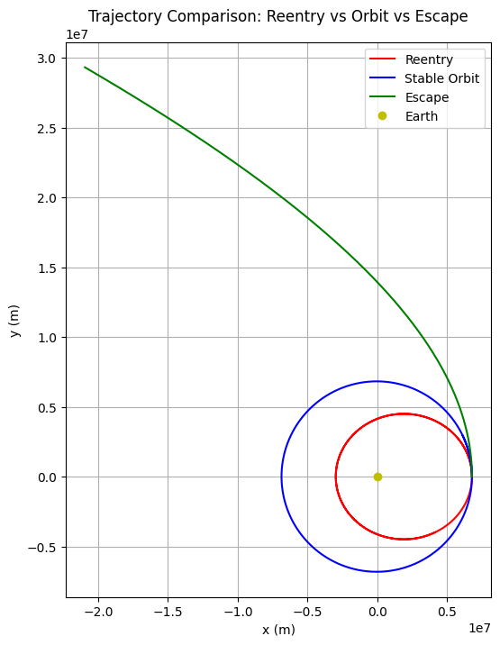
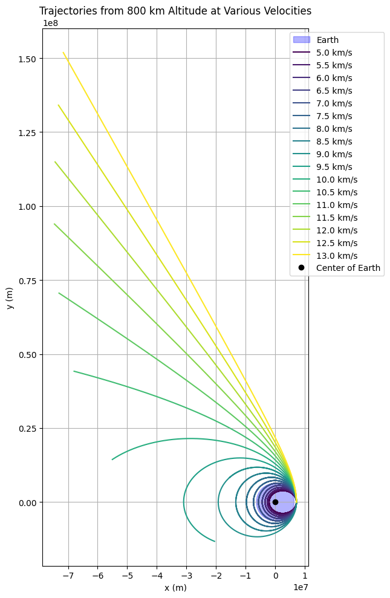

# Problem 3
# Trajectories of a Freely Released Payload Near Earth

## Motivation

When an object is released from a moving rocket near Earth, its trajectory is governed by gravitational forces and the object's initial velocity. This forms a critical area of study in orbital mechanics and is essential for space mission planning. Understanding these trajectories informs strategies for satellite deployment, payload insertion into orbit, and reentry or escape from Earth's gravitational influence.


## Theoretical Background

### Newton's Law of Gravitation

The force acting on a payload of mass  $m$ due to Earth (mass   $M$ ) at a distance $r$ from Earth's center is:
$F = \frac{GMm}{r^2}$
where $G$ is the gravitational constant.

### Equation of Motion

Using Newton's second law:
$m\ddot{\mathbf{r}} = -\frac{GMm}{r^3} \mathbf{r}$
$\Rightarrow \ddot{\mathbf{r}} = -\frac{GM}{r^3} \mathbf{r}$
This differential equation governs the acceleration of the payload under gravity.

Kepler’s Laws of Orbital Motion

1. First Law: Planets (and payloads) move in ellipses with the Earth at one focus.

2. Second Law: A line connecting the payload and Earth sweeps equal areas in equal times.

3. Third Law: The square of the orbital period is proportional to the cube of the semi-major axis.

These laws provide insight into the shapes and timings of orbits resulting from different initial conditions.
### Types of Trajectories

- **Elliptical**: $0 < e < 1$– bound orbits.
- **Parabolic**: $e = 1$ – escape at exact escape velocity.
- **Hyperbolic**: $e > 1$ – escape trajectory with excess velocity.
- **Circular**: Special case of elliptical orbit when eccentricity $e = 0$.

## Numerical Simulation

Python and numerical integration methods (e.g., Runge-Kutta) are used to simulate motion. Simulations include various initial conditions:
- Velocity below orbital speed (leading to reentry)
- Velocity equal to orbital speed (leading to stable orbit)
- Velocity above escape speed (leading to hyperbolic escape)

The simulation visualizes:
- Trajectories in 2D/3D space
- Velocity and altitude over time
- Comparison of orbital types

```python
initial_velocities = [6000, 7700, 11000]  # Reentry, stable orbit, escape trajectory
colors = ['red', 'blue', 'green']
labels = ['Reentry', 'Stable Orbit', 'Escape']

plt.figure(figsize=(8, 8))
for vy0, color, label in zip(initial_velocities, colors, labels):
    initial_state = [x0, y0, 0, vy0]
    sol = solve_ivp(gravity, t_span, initial_state, t_eval=t_eval, rtol=1e-8)
    plt.plot(sol.y[0], sol.y[1], color=color, label=label)

plt.plot(0, 0, 'yo', label='Earth')
plt.gca().set_aspect('equal', adjustable='box')
plt.title('Trajectory Comparison: Reentry vs Orbit vs Escape')
plt.xlabel('x (m)')
plt.ylabel('y (m)')
plt.legend()
plt.grid(True)
plt.show()
```


```python
import numpy as np
import matplotlib.pyplot as plt
from scipy.integrate import solve_ivp

# Constants
G = 6.67430e-11  # gravitational constant, m^3/kg/s^2
M = 5.972e24     # mass of Earth, kg
R_earth = 6.371e6  # radius of Earth, m

# Gravitational acceleration function
def gravity(t, state):
    x, y, vx, vy = state
    r = np.sqrt(x**2 + y**2)
    ax = -G * M * x / r**3
    ay = -G * M * y / r**3
    return [vx, vy, ax, ay]

# Initial position: 800 km above Earth's surface on the x-axis
altitude = 800e3  # 800 km
x0 = R_earth + altitude
y0 = 0
vx0 = 0

# Time parameters
t_span = (0, 20000)  # seconds
t_eval = np.linspace(*t_span, 2000)

# Initial velocities in m/s
velocities = np.arange(5000, 13500, 500)  # from 5 km/s to 13 km/s
colors = plt.cm.viridis(np.linspace(0, 1, len(velocities)))

# Plot setup
plt.figure(figsize=(10, 10))

# Plot Earth
earth = plt.Circle((0, 0), R_earth, color='blue', alpha=0.3, label='Earth')
plt.gca().add_patch(earth)

# Plot trajectories for each initial velocity
for v, color in zip(velocities, colors):
    initial_state = [x0, y0, 0, v]
    sol = solve_ivp(gravity, t_span, initial_state, t_eval=t_eval, rtol=1e-8)
    plt.plot(sol.y[0], sol.y[1], color=color, label=f'{v/1000:.1f} km/s')

# Final plot touches
plt.plot(0, 0, 'ko', label='Center of Earth')
plt.xlabel('x (m)')
plt.ylabel('y (m)')
plt.title('Trajectories from 800 km Altitude at Various Velocities')
plt.gca().set_aspect('equal', adjustable='box')
plt.grid(True)
plt.legend(loc='upper right', bbox_to_anchor=(1.3, 1.0))
plt.tight_layout()
plt.show()
```


## Computational Tool

A Python notebook is developed using libraries such as NumPy, SciPy, and Matplotlib:

- User inputs initial position and velocity.
- Gravitational acceleration is computed.
- Time integration is performed using ODE solvers.
- Trajectories are plotted dynamically.

```python
import numpy as np
from scipy.integrate import solve_ivp
import matplotlib.pyplot as plt

# Constants
G = 6.67430e-11  # gravitational constant
M = 5.972e24     # mass of Earth
R_earth = 6.371e6  # radius of Earth

# Gravitational acceleration
def gravity(t, state):
    x, y, vx, vy = state
    r = np.sqrt(x**2 + y**2)
    ax = -G * M * x / r**3
    ay = -G * M * y / r**3
    return [vx, vy, ax, ay]

# Initial conditions
x0 = R_earth + 400e3  # initial altitude: 400 km above Earth's surface
y0 = 0
vx0 = 0
vy0 = 7700  # approximate low Earth orbital speed
initial_state = [x0, y0, vx0, vy0]

# Time span for integration
t_span = (0, 6000)  # seconds
t_eval = np.linspace(*t_span, 1000)

# Solve ODE
solution = solve_ivp(gravity, t_span, initial_state, t_eval=t_eval, rtol=1e-8)

# Plotting
plt.figure(figsize=(8, 8))
plt.plot(solution.y[0], solution.y[1])
plt.plot(0, 0, 'yo', label='Earth')
plt.gca().set_aspect('equal', adjustable='box')
plt.title('Payload Trajectory')
plt.xlabel('x (m)')
plt.ylabel('y (m)')
plt.legend()
plt.grid(True)
plt.show()
```


## Real-World Applications

- **Orbital Insertion**: Choosing correct velocity and direction ensures desired orbit.
- **Reentry**: Predicting where and when a payload returns to Earth.
- **Escape Trajectories**: Calculating minimal velocity for leaving Earth’s gravity.
- **Mission Planning**: Used by space agencies to plan satellite launches and planetary missions.

## Deliverables

- A Python notebook with simulation and visualization.
- Markdown documentation explaining theoretical background and simulation approach.
- Graphical results showing different trajectory types based on input conditions.

## Conclusion

By understanding and simulating the gravitational motion of payloads released near Earth, engineers and scientists can better plan space missions and predict payload behavior. This analysis merges classical mechanics with computational tools to solve real-world problems in space exploration.

