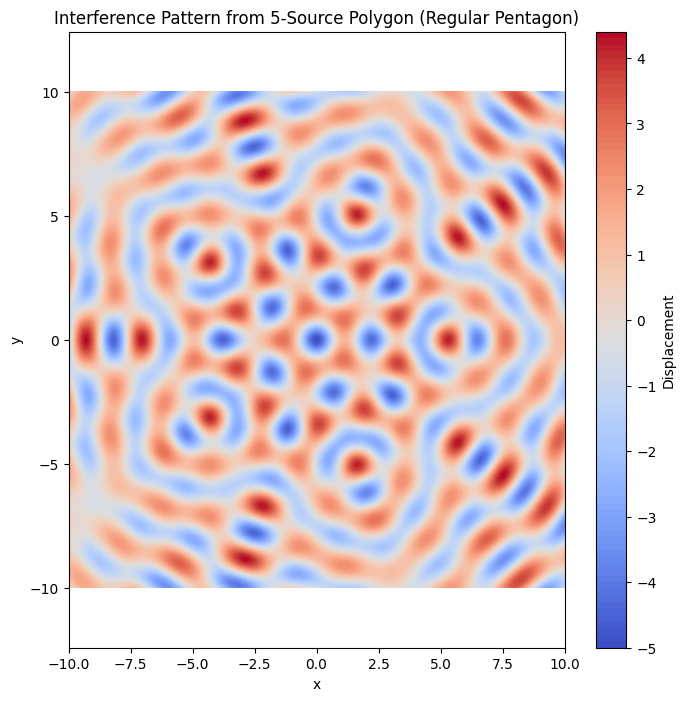
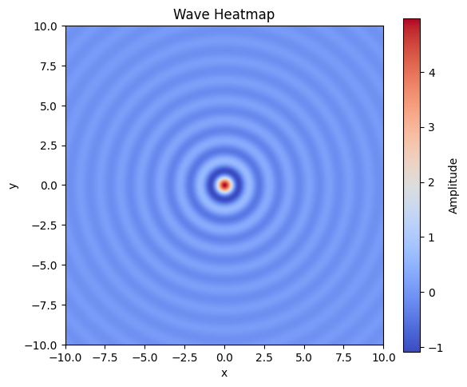
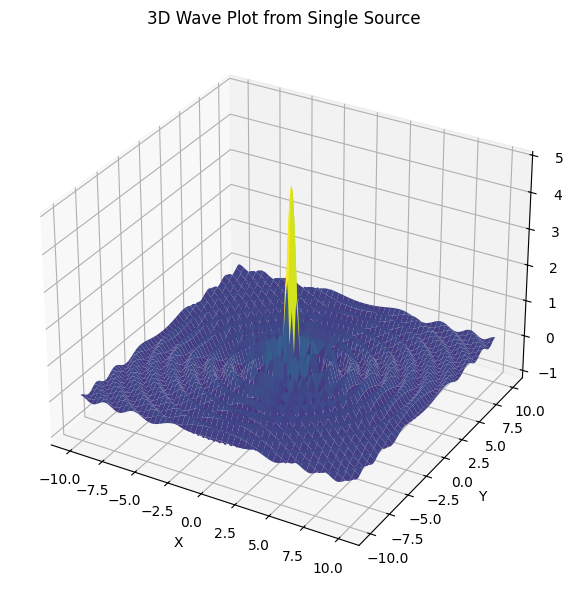

# Problem 1
# Interference Patterns on a Water Surface

## 1. Motivation

Interference occurs when waves from different sources overlap, creating new patterns of constructive and destructive interference. This is particularly visible on water surfaces, where ripples intersect and produce easily observable effects.

By analyzing interference patterns, we gain insight into fundamental wave behavior — such as superposition, phase relationships, and coherence. This experiment provides a visual and intuitive understanding of these concepts using water waves, making it an engaging introduction to wave physics.

## 2. Task Overview

To study interference patterns, we will simulate circular waves emitted from point sources placed at the vertices of a regular polygon. We will:

- Choose a regular polygon.
- Model each wave mathematically.
- Superimpose the waves.
- Visualize the resulting interference pattern.
- Analyze regions of constructive and destructive interference.

## 3. Mathematical Background

### Single Wave Equation

A circular wave on the water surface from a point source at position $$(x_i, y_i)$$ is described as:

$$
\eta_i(x, y, t) = A \cos(k r_i - \omega t + \phi)
$$

Where:

- $\eta_i(x, y, t)$ is the displacement of the water surface from source $i$  
- $A$ is the amplitude  
- $k = \frac{2\pi}{\lambda}$ is the wave number  
- $\omega = 2\pi f$ is the angular frequency  
- $r_i = \sqrt{(x - x_i)^2 + (y - y_i)^2}$ is the distance from the source  
- $\phi$ is the initial phase (assumed 0 for all sources)

### Superposition Principle

The total displacement at point $(x, y)$ and time $t$ is:

$\eta(x, y, t) = \sum_{i=1}^{N} \eta_i(x, y, t)$

Where $N$ is the number of sources.

## 4. Implementation in Python

```python
import numpy as np
import matplotlib.pyplot as plt

# Parameters
A = 1               # Amplitude
wavelength = 2      # Wavelength
frequency = 1       # Frequency (Hz)
omega = 2 * np.pi * frequency
k = 2 * np.pi / wavelength
phi = 0             # Initial phase
N = 5               # Number of sources (e.g., regular pentagon)
radius = 5          # Radius of the polygon
t = 0               # Snapshot at time t = 0

# Grid for visualization
x = np.linspace(-10, 10, 500)
y = np.linspace(-10, 10, 500)
X, Y = np.meshgrid(x, y)

# Source positions at the vertices of a regular polygon
angles = np.linspace(0, 2 * np.pi, N, endpoint=False)
source_positions = [(radius * np.cos(a), radius * np.sin(a)) for a in angles]

# Calculate wave superposition
eta = np.zeros_like(X)
for (xi, yi) in source_positions:
    r = np.sqrt((X - xi)**2 + (Y - yi)**2)
    eta += A * np.cos(k * r - omega * t + phi)

# Plot
plt.figure(figsize=(8, 8))
plt.contourf(X, Y, eta, levels=100, cmap='coolwarm')
plt.colorbar(label='Displacement')
plt.title(f'Interference Pattern from {N}-Source Polygon (Regular Pentagon)')
plt.xlabel('x')
plt.ylabel('y')
plt.axis('equal')
plt.grid(False)
plt.show()
import numpy as np
import matplotlib.pyplot as plt

# Create a grid
x = np.linspace(-10, 10, 400)
y = np.linspace(-10, 10, 400)
X, Y = np.meshgrid(x, y)
R = np.sqrt(X**2 + Y**2)

# Create wave pattern
Z = np.sin(5 * R) / (R + 1e-6)

# Plot and save heatmap
plt.figure(figsize=(6, 5))
plt.title("Wave Heatmap")
plt.imshow(Z, extent=(-10, 10, -10, 10), cmap='coolwarm', origin='lower')
plt.colorbar(label='Amplitude')
plt.xlabel('x')
plt.ylabel('y')
plt.grid(False)
plt.tight_layout()
plt.savefig("wave_heatmap.png", dpi=300)
plt.show()
import numpy as np
import matplotlib.pyplot as plt

# Create a grid
x = np.linspace(-10, 10, 400)
y = np.linspace(-10, 10, 400)
X, Y = np.meshgrid(x, y)
R = np.sqrt(X**2 + Y**2)

# Create wave pattern
Z = np.sin(5 * R) / (R + 1e-6)

# Plot and save heatmap
plt.figure(figsize=(6, 5))
plt.title("Wave Heatmap")
plt.imshow(Z, extent=(-10, 10, -10, 10), cmap='coolwarm', origin='lower')
plt.colorbar(label='Amplitude')
plt.xlabel('x')
plt.ylabel('y')
plt.grid(False)
plt.tight_layout()
plt.savefig("wave_heatmap.png", dpi=300)
plt.show()
```



```python
import numpy as np
import matplotlib.pyplot as plt

# Create a grid
x = np.linspace(-10, 10, 400)
y = np.linspace(-10, 10, 400)
X, Y = np.meshgrid(x, y)
R = np.sqrt(X**2 + Y**2)

# Create wave pattern
Z = np.sin(5 * R) / (R + 1e-6)

# Plot and save heatmap
plt.figure(figsize=(6, 5))
plt.title("Wave Heatmap")
plt.imshow(Z, extent=(-10, 10, -10, 10), cmap='coolwarm', origin='lower')
plt.colorbar(label='Amplitude')
plt.xlabel('x')
plt.ylabel('y')
plt.grid(False)
plt.tight_layout()
plt.savefig("wave_heatmap.png", dpi=300)
plt.show()
``` 



```python
import numpy as np
import matplotlib.pyplot as plt
from mpl_toolkits.mplot3d import Axes3D

# Create a grid
x = np.linspace(-10, 10, 400)
y = np.linspace(-10, 10, 400)
X, Y = np.meshgrid(x, y)
R = np.sqrt(X**2 + Y**2)

# Create wave pattern
Z = np.sin(5 * R) / (R + 1e-6)

# Plot and save 3D surface
fig = plt.figure(figsize=(8, 6))
ax = fig.add_subplot(111, projection='3d')
ax.plot_surface(X, Y, Z, cmap='viridis', edgecolor='none')
ax.set_title('3D Wave Plot from Single Source')
ax.set_xlabel('X')
ax.set_ylabel('Y')
ax.set_zlabel('Amplitude')
plt.tight_layout()
plt.savefig("wave_3d_surface.png", dpi=300)
plt.show()
```




## 5. Observations and Analysis

Constructive Interference: Occurs where wave crests align, increasing amplitude. These appear as ridges or bright bands in the plot.

Destructive Interference: Occurs where a crest meets a trough, canceling out. These are shown as flat (dark) regions.

Symmetry: Due to the regular polygon setup and equal wave properties, the interference pattern is symmetrical, matching the geometry of the polygon.

The complexity of the pattern increases with the number of sources, leading to denser interference zones.

## 6. Conclusion

This simulation demonstrates the power of superposition in wave physics. By modeling water wave interference from a regular polygon arrangement, we observe both constructive and destructive interference in a visually striking and symmetric pattern.

This exercise reinforces key wave principles and highlights the utility of simulation in physics education.