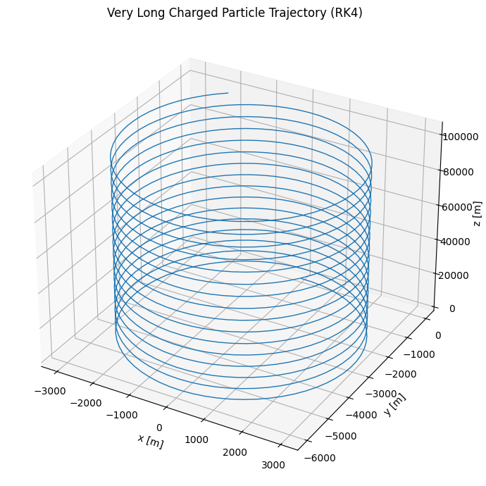
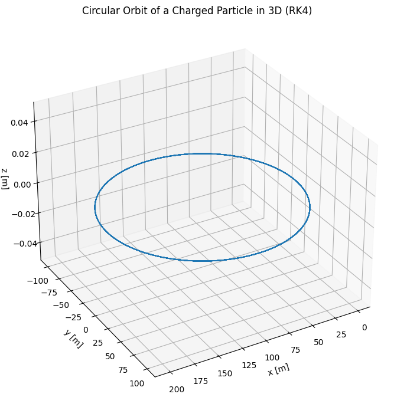
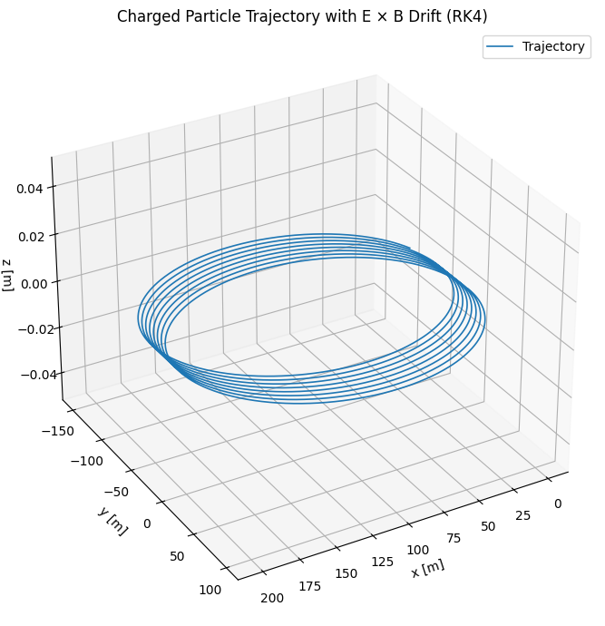
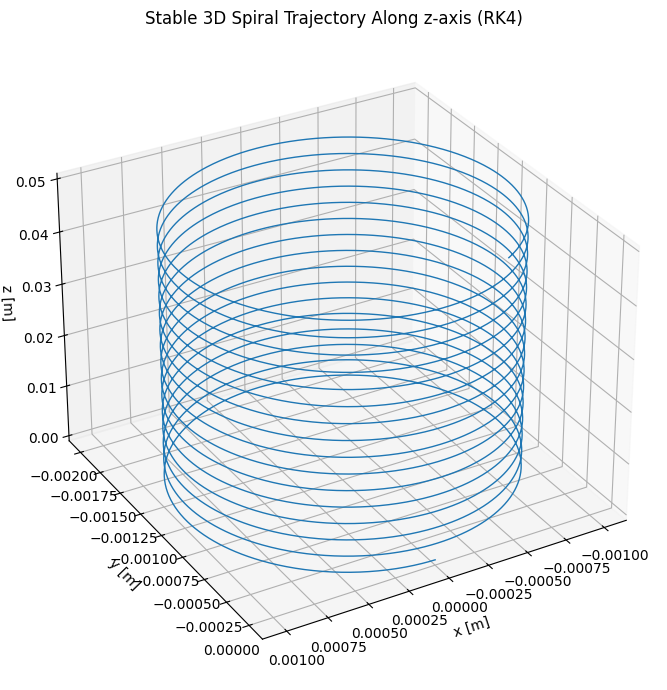

# Problem 1

# Electromagnetism: Simulating the Effects of the Lorentz Force

## Problem 1: Lorentz Force

### Motivation

The **Lorentz force**, given by:

$$
\vec{F} = q(\vec{E} + \vec{v} \times \vec{B}),
$$

describes the force acting on a charged particle in electric ($$\vec{E}$$) and magnetic ($$\vec{B}$$) fields. This principle is foundational in particle accelerators, plasma confinement systems, and devices like mass spectrometers.

Understanding and visualizing the trajectories resulting from this force helps in designing and interpreting physical systems where charged particles interact with electromagnetic fields.

---

## 1. Applications of the Lorentz Force

### Key Systems:
- **Particle Accelerators** – Use electric fields to accelerate and magnetic fields to steer particles.
- **Mass Spectrometers** – Use $$ \vec{v} \times \vec{B} $$ to separate particles by mass-to-charge ratio.
- **Plasma Confinement** (e.g., Tokamaks) – Use strong magnetic fields to confine plasma.

### Relevance of Fields:
- **Electric Fields ($$\vec{E}$$)**: Accelerate particles.
- **Magnetic Fields ($$\vec{B}$$)**: Curve particle paths, confine motion.

---

## 2. Simulating Particle Motion

### Parameters:
- Charge: $$ q = 1 \, \text{C} $$
- Mass: $$ m = 1 \, \text{g} = 0.001 \, \text{kg} $$

We solve the equations of motion:

$$
\frac{d\vec{v}}{dt} = \frac{q}{m}(\vec{E} + \vec{v} \times \vec{B}), \quad
\frac{d\vec{r}}{dt} = \vec{v}
$$

### Numerical Integration (RK4):

```python
import numpy as np
import matplotlib.pyplot as plt
from mpl_toolkits.mplot3d import Axes3D

# Constants
q = 1.0           # Charge (C)
m = 0.001         # Mass (kg)
c = 3e8           # Speed of light (m/s)
dt = 1e-6         # Time step (s)
steps = 100000    # Number of steps for a long trajectory

# Fields
E = np.array([0.0, 0.0, 1e3])      # Electric field (V/m)
B = np.array([0.0, 0.0, 1.0])      # Magnetic field (T)

# Initial conditions
r = np.zeros((steps, 3))           # Position array
v = np.zeros((steps, 3))           # Velocity array
r[0] = np.array([0.0, 0.0, 0.0])   # Initial position
v[0] = np.array([3e6, 0.0, 1e6])   # Initial velocity

def acceleration(v):
    return (q / m) * (E + np.cross(v, B))

# RK4 integration
for i in range(steps - 1):
    a1 = acceleration(v[i])
    k1v = a1 * dt
    k1r = v[i] * dt

    a2 = acceleration(v[i] + 0.5 * k1v)
    k2v = a2 * dt
    k2r = (v[i] + 0.5 * k1v) * dt

    a3 = acceleration(v[i] + 0.5 * k2v)
    k3v = a3 * dt
    k3r = (v[i] + 0.5 * k2v) * dt

    a4 = acceleration(v[i] + k3v)
    k4v = a4 * dt
    k4r = (v[i] + k3v) * dt

    v[i + 1] = v[i] + (k1v + 2 * k2v + 2 * k3v + k4v) / 6
    r[i + 1] = r[i] + (k1r + 2 * k2r + 2 * k3r + k4r) / 6

# Plot 3D trajectory (sample every 100 points for speed)
fig = plt.figure(figsize=(10, 7))
ax = fig.add_subplot(111, projection='3d')
ax.plot(r[::100, 0], r[::100, 1], r[::100, 2], linewidth=1)
ax.set_title("Very Long Charged Particle Trajectory (RK4)")
ax.set_xlabel("x [m]")
ax.set_ylabel("y [m]")
ax.set_zlabel("z [m]")
plt.tight_layout()
plt.show()
```



## 3. Trajectory Scenarios

### A. Circular Motion (Uniform $$\vec{B}$$, No $$\vec{E}$$)

- **Initial condition**: Velocity is perpendicular to the magnetic field.
- **Expected trajectory**: Circle in the plane perpendicular to $$\vec{B}$$.

#### Physical Background

A charged particle in a uniform magnetic field experiences a centripetal force due to the Lorentz force:

$$
\vec{F} = q\vec{v} \times \vec{B}
$$

If $$\vec{v} \perp \vec{B}$$ and there is no electric field, the particle moves in a circle with radius:

$$
r_L = \frac{mv}{qB}
$$

and angular frequency:

$$
\omega_c = \frac{qB}{m}
$$

#### Python Simulation Code

```python
import numpy as np
import matplotlib.pyplot as plt
from mpl_toolkits.mplot3d import Axes3D

# Constants
q = 1.0           # Charge (C)
m = 0.001         # Mass (kg)
dt = 1e-6         # Time step (s)
steps = 50000     # Number of steps
B = np.array([0.0, 0.0, 1.0])   # Magnetic field (T)
E = np.array([0.0, 0.0, 0.0])   # No electric field

# Initial conditions
r = np.zeros((steps, 3))           # Position array
v = np.zeros((steps, 3))           # Velocity array

# Start at origin, with velocity along y and B along z → orbit in x-y plane
r[0] = np.array([1.0, 0.0, 0.0])         # Start off-center
v[0] = np.array([0.0, 1e5, 0.0])         # Perpendicular to B for circular orbit

def acceleration(v):
    return (q / m) * (E + np.cross(v, B))

# RK4 integration
for i in range(steps - 1):
    a1 = acceleration(v[i])
    k1v = a1 * dt
    k1r = v[i] * dt

    a2 = acceleration(v[i] + 0.5 * k1v)
    k2v = a2 * dt
    k2r = (v[i] + 0.5 * k1v) * dt

    a3 = acceleration(v[i] + 0.5 * k2v)
    k3v = a3 * dt
    k3r = (v[i] + 0.5 * k2v) * dt

    a4 = acceleration(v[i] + k3v)
    k4v = a4 * dt
    k4r = (v[i] + k3v) * dt

    v[i + 1] = v[i] + (k1v + 2 * k2v + 2 * k3v + k4v) / 6
    r[i + 1] = r[i] + (k1r + 2 * k2r + 2 * k3r + k4r) / 6

# Plot 3D trajectory (it will be in x–y plane with constant z)
fig = plt.figure(figsize=(10, 7))
ax = fig.add_subplot(111, projection='3d')
ax.plot(r[::10, 0], r[::10, 1], r[::10, 2], linewidth=1.2)
ax.set_title("Circular Orbit of a Charged Particle in 3D (RK4)")
ax.set_xlabel("x [m]")
ax.set_ylabel("y [m]")
ax.set_zlabel("z [m]")
ax.view_init(elev=30, azim=60)
plt.tight_layout()
plt.show()
```



### B. Spiral in Z-direction

- **Initial condition**: Add a vertical velocity component $$v_z$$ to the initial velocity.
- **Expected trajectory**: Helical motion (spiral) around the magnetic field lines in the z-direction.

#### Physical Background

When a charged particle has a velocity component both **perpendicular** and **parallel** to a uniform magnetic field $$\vec{B}$$, it follows a **helical** path.

- Circular motion in the plane perpendicular to $$\vec{B}$$
- Constant drift along the direction of $$\vec{B}$$

This results in a **spiral trajectory** along the z-axis.

#### Python Simulation Code

```python
import numpy as np
import matplotlib.pyplot as plt
from mpl_toolkits.mplot3d import Axes3D

# Constants
q = 1.0            # Charge (C)
m = 0.001          # Mass (kg)
dt = 1e-6          # Time step (s)
steps = 50000      # Number of steps
B = np.array([0.0, 0.0, 1.0])     # Magnetic field along z (T)
E = np.array([1e3, 0.0, 0.0])     # Electric field along x (V/m)

# Compute theoretical E x B drift velocity
v_drift = np.cross(E, B) / np.dot(B, B)
print(f"Theoretical E x B drift velocity: {v_drift} m/s")

# Initial conditions
r = np.zeros((steps, 3))          # Position array
v = np.zeros((steps, 3))          # Velocity array

# Start at origin with perpendicular velocity to B
r[0] = np.array([0.0, 0.0, 0.0])
v[0] = np.array([0.0, 1e5, 0.0])  # Perpendicular to B, causes gyration

def acceleration(v):
    return (q / m) * (E + np.cross(v, B))

# RK4 integration loop
for i in range(steps - 1):
    a1 = acceleration(v[i])
    k1v = a1 * dt
    k1r = v[i] * dt

    a2 = acceleration(v[i] + 0.5 * k1v)
    k2v = a2 * dt
    k2r = (v[i] + 0.5 * k1v) * dt

    a3 = acceleration(v[i] + 0.5 * k2v)
    k3v = a3 * dt
    k3r = (v[i] + 0.5 * k2v) * dt

    a4 = acceleration(v[i] + k3v)
    k4v = a4 * dt
    k4r = (v[i] + k3v) * dt

    v[i + 1] = v[i] + (k1v + 2 * k2v + 2 * k3v + k4v) / 6
    r[i + 1] = r[i] + (k1r + 2 * k2r + 2 * k3r + k4r) / 6

# Plot 3D trajectory
fig = plt.figure(figsize=(10, 7))
ax = fig.add_subplot(111, projection='3d')
ax.plot(r[::10, 0], r[::10, 1], r[::10, 2], linewidth=1.2, label='Trajectory')
ax.set_title("Charged Particle Trajectory with E × B Drift (RK4)")
ax.set_xlabel("x [m]")
ax.set_ylabel("y [m]")
ax.set_zlabel("z [m]")
ax.view_init(elev=30, azim=60)
ax.legend()
plt.tight_layout()
plt.show()
```



### B. Spiral in Z-direction

- **Initial condition**: Add a vertical velocity component $$v_z$$ to the initial velocity.
- **Expected trajectory**: Helical motion (spiral) around the magnetic field lines in the z-direction.

#### Physical Background

When a charged particle has a velocity component both **perpendicular** and **parallel** to a uniform magnetic field $$\vec{B}$$, it follows a **helical** path.

- Circular motion in the plane perpendicular to $$\vec{B}$$
- Constant drift along the direction of $$\vec{B}$$

This results in a **spiral trajectory** along the z-axis.

#### Python Simulation Code

```python
import numpy as np
import matplotlib.pyplot as plt
from mpl_toolkits.mplot3d import Axes3D

# Constants
q = 1.0        # Charge (C)
m = 0.001      # Mass (kg)
dt = 1e-5      # Smaller time step for stability
T = 0.1        # Shorter total time to keep computation reasonable
N = int(T / dt)

# Fields
B = np.array([0, 0, 1.0])  # Magnetic field (T)
E = np.array([0, 0, 0])    # No electric field

# Initial conditions: circular motion + axial drift
v0 = np.array([1.0, 0.0, 0.5])  # x-y circular, z linear
r0 = np.array([0.0, 0.0, 0.0])

# Initialize arrays
r = np.zeros((N, 3))
v = np.zeros((N, 3))
r[0] = r0
v[0] = v0

# Lorentz force acceleration
def acceleration(v):
    return (q / m) * (E + np.cross(v, B))

# RK4 integration
for i in range(N - 1):
    a1 = acceleration(v[i])
    k1v = a1 * dt
    k1r = v[i] * dt

    a2 = acceleration(v[i] + 0.5 * k1v)
    k2v = a2 * dt
    k2r = (v[i] + 0.5 * k1v) * dt

    a3 = acceleration(v[i] + 0.5 * k2v)
    k3v = a3 * dt
    k3r = (v[i] + 0.5 * k2v) * dt

    a4 = acceleration(v[i] + k3v)
    k4v = a4 * dt
    k4r = (v[i] + k3v) * dt

    v[i + 1] = v[i] + (k1v + 2*k2v + 2*k3v + k4v) / 6
    r[i + 1] = r[i] + (k1r + 2*k2r + 2*k3r + k4r) / 6

# Plot the helical trajectory
fig = plt.figure(figsize=(10, 7))
ax = fig.add_subplot(111, projection='3d')
ax.plot(r[:, 0], r[:, 1], r[:, 2], linewidth=1)
ax.set_title("Stable 3D Spiral Trajectory Along z-axis (RK4)")
ax.set_xlabel("x [m]")
ax.set_ylabel("y [m]")
ax.set_zlabel("z [m]")
ax.view_init(elev=30, azim=60)
plt.tight_layout()
plt.show()
```



### C. Crossed Fields – Drift Motion

- **Field configuration**: Apply crossed electric and magnetic fields:
  
  $$
  \vec{E} = [1, 0, 0], \quad \vec{B} = [0, 0, 1]
  $$

- **Expected result**: The particle experiences a drift due to the cross product:

  $$
  \vec{v}_d = \frac{\vec{E} \times \vec{B}}{B^2}
  $$

This drift is perpendicular to both the electric and magnetic fields, causing the charged particle to move with a constant velocity in the $$y$$-direction while spiraling due to the magnetic field.


## 4. Parameter Exploration

### Parameters to Vary:

- Electric field $$\vec{E}$$ and magnetic field $$\vec{B}$$ strengths and directions
- Initial velocity vector $$\vec{v}_0$$
- Charge-to-mass ratio $$\frac{q}{m}$$

### Key Quantities to Observe:

- **Larmor radius** (radius of circular motion):

  $$
  r_L = \frac{mv_\perp}{qB}
  $$

- **Cyclotron frequency** (angular frequency of rotation):

  $$
  \omega_c = \frac{qB}{m}
  $$

- **Drift velocity** in crossed electric and magnetic fields:

  $$
  \vec{v}_d = \frac{\vec{E} \times \vec{B}}{B^2}
  $$

Use these analytical relationships to:

- Predict the trajectory before simulating.
- Compare numerical results to theoretical expectations.
- Validate your code's physical accuracy.

---

## 5. Real-World Relevance

| System               | Role of Lorentz Force                                            |
|----------------------|------------------------------------------------------------------|
| **Cyclotron**        | Charged particles move in circular paths under $$\vec{B}$$.      |
| **Mass Spectrometer**| Particle curvature $$\propto \frac{m}{q}$$ helps identify isotopes.|
| **Magnetic Bottle**  | Magnetic mirror effect traps particles via field gradients.      |
| **Solar Wind**       | Charged solar particles are deflected by Earth's magnetosphere.  |

These systems depend critically on the Lorentz force to manipulate, trap, or sort charged particles.

---

## 6. Extension Ideas

To make the simulation more advanced and realistic, consider exploring:

- **Non-uniform magnetic fields**  
  (e.g., magnetic mirrors, Earth's dipole field, magnetic bottles)

- **Time-varying electric fields**  
  (as seen in radio-frequency (RF) ion traps and linear accelerators)

- **Multiple interacting particles**  
  (introduce Coulomb forces to simulate plasma dynamics)

- **Relativistic effects**  
  (for particles approaching the speed of light, modify Newtonian dynamics)

- **Focusing and guiding mechanisms in accelerators**  
  (e.g., quadrupole magnets, beam optics)

These features reflect real-world complexities and provide stepping stones toward simulating full plasma systems, particle accelerators, and astrophysical plasmas.

---
