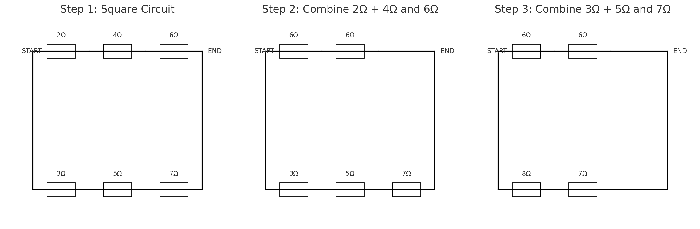
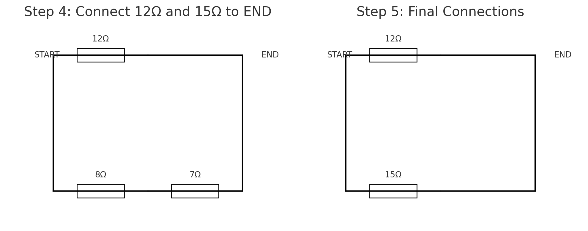
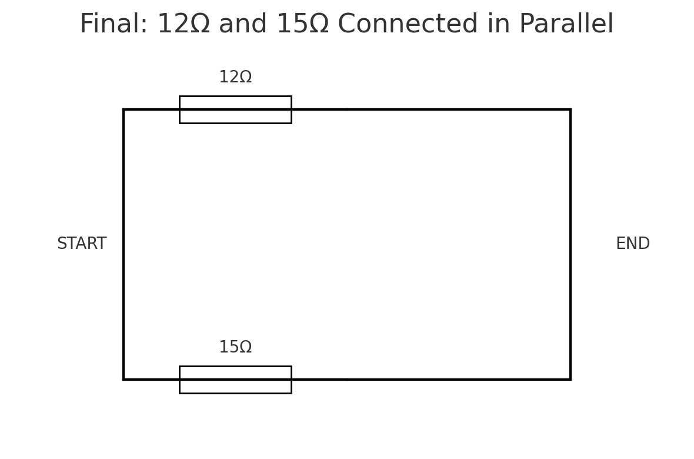

# Problem 1

# Equivalent Resistance Using Graph Theory

### Motivation

The **equivalent resistance** between two terminals (START and END) in an electrical network is a central concept in circuit analysis. While basic configurations can be handled with simple series and parallel rules, **complex circuits** with many junctions and loops require a more robust approach.

Using **graph theory**, we model the circuit as a graph where:
- **Nodes** represent junctions,
- **Edges** represent resistors,
- **Weights** on edges represent resistance values.

This transforms circuit simplification into a graph-reduction problem. The process can be fully automated and is essential for tasks like circuit simulation, network optimization, and computer-aided design.

---

## 1. Graph-Based Circuit Simplification

### Step-by-Step Approach

Given a weighted undirected graph:

- START and END are the terminals.
- Each edge $e_{ij}$ has a resistance $R_{ij}$.
- The goal is to compute a single equivalent resistance $R_{\text{eq}}$ between START and END.

We apply the following reduction rules iteratively:

---

### 1.1 Series Reduction

If a node (not START or END) has exactly two neighbors and connects only to them, its resistors are in **series**.

Replace this subgraph:

A -- R₁ -- B -- R₂ -- C


with:

A -- R₁₂ -- C


Where:

$$
R_{\text{eq}} = R_1 + R_2
$$

---

### 1.2 Parallel Reduction

If multiple resistors connect the same two nodes, they are in **parallel**.

Replace this:

A -- R₁ -- B
A -- R₂ -- B


with:

$$A -- R_{\text{eq}} -- B$$


Where:

$$
\frac{1}{R_{\text{eq}}} = \frac{1}{R_1} + \frac{1}{R_2}
$$

---

### 1.3 Iteration

Repeat series and parallel simplification until only one resistor remains between START and END:

$$
R_{\text{total}} = R_{\text{eq}}
$$

---

```python
import networkx as nx
import matplotlib.pyplot as plt
from IPython.display import display, Image
import io

# Global step counter
step_counter = 0

# Initialize graph
G = nx.DiGraph()
edges = [
    ('B+', 'R2'), ('R2', 'R3'), ('R3', 'R4'), ('B+', 'R1'), ('R1', 'R4'),
    ('R4', 'R5'), ('R5', 'B-')
]
G.add_edges_from(edges)

def draw_graph(G, highlight_nodes=[], title="Step"):
    global step_counter
    print(f"Drawing graph: {title}")
    pos = nx.spring_layout(G, seed=42)
    fig, ax = plt.subplots(figsize=(8, 6))
    node_colors = ['red' if node in highlight_nodes else 'lightgray' for node in G.nodes()]
    nx.draw(G, pos, with_labels=True, arrows=True, node_color=node_colors, node_size=1000, ax=ax)
    plt.title(title)

    buf = io.BytesIO()
    plt.savefig(buf, format='png')
    buf.seek(0)
    display(Image(data=buf.read()))
    plt.close()
    step_counter += 1

# Step 1: Draw initial
draw_graph(G, title="Initial Circuit")

# === Step 2: Series Merge R2 + R3 -> R23 ===
G.add_edge('R23', 'R4')
G.remove_edge('R2', 'R3')
G.remove_edge('R3', 'R4')
G = nx.relabel_nodes(G, {'R2': 'R23'})
G.remove_node('R3')
draw_graph(G, highlight_nodes=['R23'], title="Series Merge: R2 + R3 → R23")

# === Step 3: Series Merge R4 + R5 -> R45 ===
G.add_edge('R45', 'B-')
G.remove_edge('R4', 'R5')
G.remove_edge('R5', 'B-')
G = nx.relabel_nodes(G, {'R4': 'R45'})
G.remove_node('R5')
draw_graph(G, highlight_nodes=['R45'], title="Series Merge: R4 + R5 → R45")

# === Step 4: Connect R1 and R23 directly to R45 if not already ===
# (This ensures all 3 are feeding into same node)
G.add_edge('R1', 'R45')
G.add_edge('R23', 'R45')

# === Step 5: Merge R1, R23, R45 (Parallel) → R12345 ===
# All three go from B+ to B-, now merge into single R12345
G.add_edge('R12345', 'B-')
G.remove_edge('R1', 'R45')
G.remove_edge('R23', 'R45')
G.remove_edge('R45', 'B-')
G = nx.relabel_nodes(G, {'R1': 'R12345'})
G.remove_node('R23')
G.remove_node('R45')
draw_graph(G, highlight_nodes=['R12345'], title="Parallel Merge: R1 || R23 || R45 → R12345")

# Final
draw_graph(G, title="Final Simplified Circuit")
```


## 2. Python Algorithm

## Step 1: Original Circuit (with parallel and series resistors)

## 3. Example Analysis

Given the test circuit:

- START → A: $R = 2\,\Omega$
- A → B: $R = 3\,\Omega$ 
- B → END: $R = 4\,\Omega$  
- A → END: $R = 6\,\Omega$  

### Step-by-step:

1. Combine A–B and B–END (series):  
   $R_{\text{AB-END}} = 3 + 4 = 7\,\Omega$

2. A has two paths to END:  
   - One path is: $7\,\Omega$  
   - Other path is: $6\,\Omega$

3. Combine those in parallel:

   $$
   \frac{1}{R_{\text{eq}}} = \frac{1}{6} + \frac{1}{7} = \frac{13}{42}
   \Rightarrow R_{\text{eq}} \approx 3.23\,\Omega
   $$

4. Finally, add START–A:

   $$
   R_{\text{total}} = 2 + 3.23 = 5.23\,\Omega
   $$

---

```python
import matplotlib.pyplot as plt
import matplotlib.patches as patches

def draw_resistor(ax, x, y, label, horizontal=True):
    if horizontal:
        ax.plot([x, x+1], [y, y], color="black")
        ax.add_patch(patches.Rectangle((x+0.25, y-0.1), 0.5, 0.2,
                                       edgecolor='black', facecolor='none'))
        ax.text(x+0.5, y+0.2, label, ha='center')
    else:
        ax.plot([x, x], [y, y-1], color="black")
        ax.add_patch(patches.Rectangle((x-0.1, y-0.75), 0.2, 0.5,
                                       edgecolor='black', facecolor='none'))
        ax.text(x+0.2, y-0.5, label, va='center')

def draw_updated_series_steps():
    fig, axs = plt.subplots(1, 3, figsize=(15, 5))
    axs = axs.flatten()

    # Step 1: Original square circuit
    ax = axs[0]
    ax.set_title("Step 1: Square Circuit")
    draw_resistor(ax, 0, 2, "2Ω")
    draw_resistor(ax, 1, 2, "4Ω")
    draw_resistor(ax, 2, 2, "6Ω")
    draw_resistor(ax, 0, 0, "3Ω")
    draw_resistor(ax, 1, 0, "5Ω")
    draw_resistor(ax, 2, 0, "7Ω")
    ax.plot([0, 0], [0, 2], color='black')
    ax.plot([3, 3], [0, 2], color='black')
    ax.text(-0.2, 2, "START", va='center')
    ax.text(3.1, 2, "END", va='center')
    ax.set_xlim(-0.5, 3.5)
    ax.set_ylim(-0.5, 2.5)
    ax.axis('off')

    # Step 2: Combine 2Ω + 4Ω = 6Ω and B–END = 6Ω
    ax = axs[1]
    ax.set_title("Step 2: Combine 2Ω + 4Ω and 6Ω")
    draw_resistor(ax, 0, 2, "6Ω")
    draw_resistor(ax, 1, 2, "6Ω")
    draw_resistor(ax, 0, 0, "3Ω")
    draw_resistor(ax, 1, 0, "5Ω")
    draw_resistor(ax, 2, 0, "7Ω")
    ax.plot([0, 0], [0, 2], color='black')  # START
    ax.plot([2, 3], [2, 2], color='black')  # Output to END
    ax.plot([3, 3], [0, 2], color='black')  # END
    ax.plot([2, 3], [0, 0], color='black')  # Bottom right to END
    ax.text(-0.2, 2, "START", va='center')
    ax.text(3.1, 2, "END", va='center')
    ax.set_xlim(-0.5, 3.5)
    ax.set_ylim(-0.5, 2.5)
    ax.axis('off')

    # Step 3: Combine 3Ω + 5Ω = 8Ω and 7Ω
    ax = axs[2]
    ax.set_title("Step 3: Combine 3Ω + 5Ω and 7Ω")
    draw_resistor(ax, 0, 2, "6Ω")
    draw_resistor(ax, 1, 2, "6Ω")
    draw_resistor(ax, 0, 0, "8Ω")
    draw_resistor(ax, 1, 0, "7Ω")
    ax.plot([0, 0], [0, 2], color='black')  # START
    ax.plot([2, 3], [2, 2], color='black')  # Top to END
    ax.plot([2, 3], [0, 0], color='black')  # Bottom to END
    ax.plot([3, 3], [0, 2], color='black')  # END
    ax.text(-0.2, 2, "START", va='center')
    ax.text(3.1, 2, "END", va='center')
    ax.set_xlim(-0.5, 3.5)
    ax.set_ylim(-0.5, 2.5)
    ax.axis('off')

    plt.tight_layout()
    plt.show()

draw_updated_series_steps()
```



```python
import matplotlib.pyplot as plt
import matplotlib.patches as patches

def draw_resistor(ax, x, y, label, horizontal=True):
    if horizontal:
        ax.plot([x, x+1], [y, y], color="black")
        ax.add_patch(patches.Rectangle((x+0.25, y-0.1), 0.5, 0.2,
                                       edgecolor='black', facecolor='none'))
        ax.text(x+0.5, y+0.2, label, ha='center')
    else:
        ax.plot([x, x], [y, y-1], color="black")
        ax.add_patch(patches.Rectangle((x-0.1, y-0.75), 0.2, 0.5,
                                       edgecolor='black', facecolor='none'))
        ax.text(x+0.2, y-0.5, label, va='center')

def draw_final_series_combinations():
    fig, axs = plt.subplots(1, 2, figsize=(10, 4))
    axs = axs.flatten()

    # Step 4: Top 12Ω and bottom 8Ω + 7Ω = 15Ω, connect to END
    ax = axs[0]
    ax.set_title("Step 4: Connect 12Ω and 15Ω to END")
    draw_resistor(ax, 0, 2, "12Ω")  # Top path result
    draw_resistor(ax, 0, 0, "8Ω")   # Bottom path before merging
    draw_resistor(ax, 1, 0, "7Ω")   # Bottom path before merging
    ax.plot([0, 0], [0, 2], color='black')  # START shared
    ax.plot([2, 2], [0, 2], color='black')  # END shared
    ax.plot([1, 2], [0, 0], color='black')  # Wire after 7Ω to END
    ax.plot([1, 2], [2, 2], color='black')  # Wire after 12Ω to END
    ax.text(-0.2, 2, "START", va='center')
    ax.text(2.2, 2, "END", va='center')
    ax.set_xlim(-0.5, 2.5)
    ax.set_ylim(-0.5, 2.5)
    ax.axis('off')

    # Step 5: 12Ω and 15Ω clearly connected to END
    ax = axs[1]
    ax.set_title("Step 5: Final Connections")
    draw_resistor(ax, 0, 2, "12Ω")  # Top path
    draw_resistor(ax, 0, 0, "15Ω")  # Bottom path
    ax.plot([0, 0], [0, 2], color='black')  # START shared
    ax.plot([2, 2], [0, 2], color='black')  # END shared
    ax.plot([1, 2], [0, 0], color='black')  # Wire after 15Ω to END
    ax.plot([1, 2], [2, 2], color='black')  # Wire after 12Ω to END
    ax.text(-0.2, 2, "START", va='center')
    ax.text(2.2, 2, "END", va='center')
    ax.set_xlim(-0.5, 2.5)
    ax.set_ylim(-0.5, 2.5)
    ax.axis('off')

    plt.tight_layout()
    plt.show()

draw_final_series_combinations()
```



```python
import matplotlib.pyplot as plt
import matplotlib.patches as patches

def draw_resistor(ax, x, y, label, horizontal=True):
    if horizontal:
        ax.plot([x, x+1], [y, y], color="black")
        ax.add_patch(patches.Rectangle((x+0.25, y-0.1), 0.5, 0.2,
                     edgecolor='black', facecolor='none'))
        ax.text(x+0.5, y+0.2, label, ha='center')
    else:
        ax.plot([x, x], [y, y-1], color="black")
        ax.add_patch(patches.Rectangle((x-0.1, y-0.75), 0.2, 0.5,
                     edgecolor='black', facecolor='none'))
        ax.text(x+0.2, y-0.5, label, va='center')

def draw_parallel_connection_with_join_lines():
    fig, ax = plt.subplots(figsize=(6, 4))

    ax.set_title("Final: 12Ω and 15Ω Connected in Parallel")

    # Draw resistors
    draw_resistor(ax, 0, 2, "12Ω")  # Top
    draw_resistor(ax, 0, 0, "15Ω")  # Bottom

    # START and END vertical lines
    ax.plot([0, 0], [0, 2], color='black')  # Left vertical (START)
    ax.plot([2, 2], [0, 2], color='black')  # Right vertical (END)

    # Connect 12Ω to END
    ax.plot([1, 2], [2, 2], color='black')  # Right side of 12Ω

    # Connect 15Ω to END
    ax.plot([1, 2], [0, 0], color='black')  # Right side of 15Ω

    # Connect START to 12Ω
    ax.plot([0, 1], [2, 2], color='black')  # Left side of 12Ω

    # Connect START to 15Ω
    ax.plot([0, 1], [0, 0], color='black')  # Left side of 15Ω

    # Labels
    ax.text(-0.3, 1, "START", va='center')
    ax.text(2.2, 1, "END", va='center')

    ax.set_xlim(-0.5, 2.5)
    ax.set_ylim(-0.5, 2.5)
    ax.axis('off')

    plt.tight_layout()
    plt.show()

draw_parallel_connection_with_join_lines()
```



## 4. Conclusion

We showed how to:

- Use graph theory to model electrical circuits.
- Detect and simplify series and parallel connections.
- Automate the process using Python and `networkx`.

This method scales well to arbitrarily complex networks and is highly applicable to modern engineering workflows such as simulation, layout, and optimization of electrical systems.
