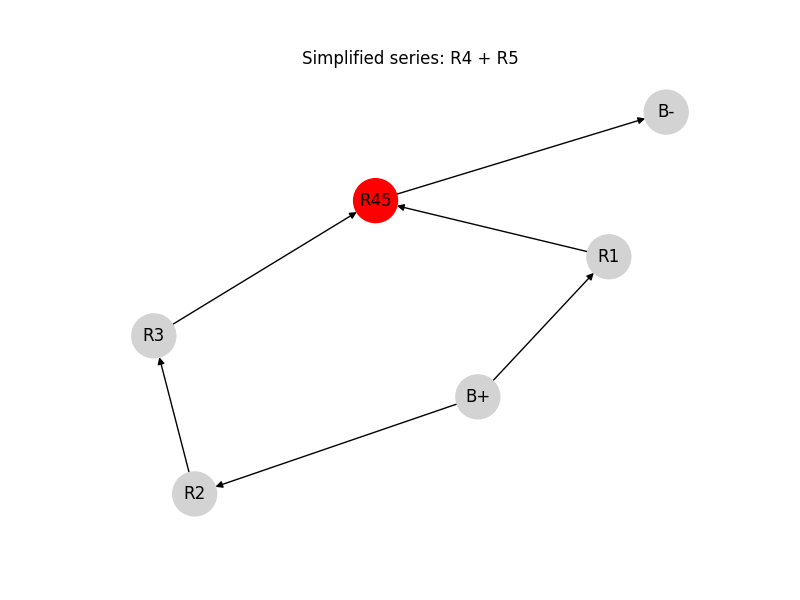
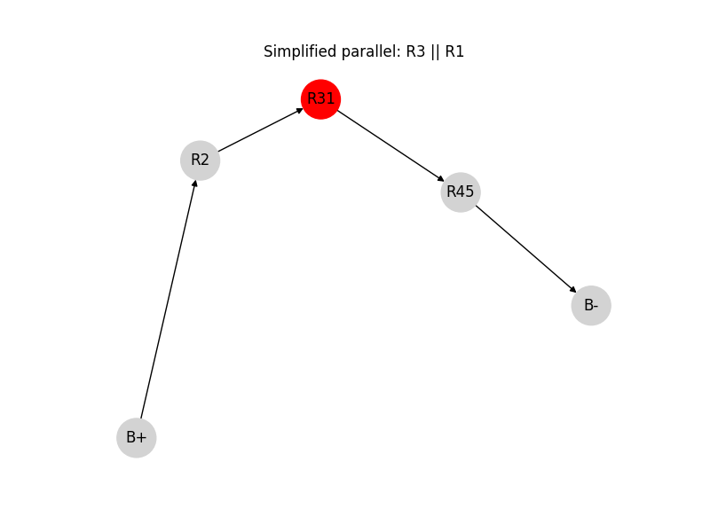
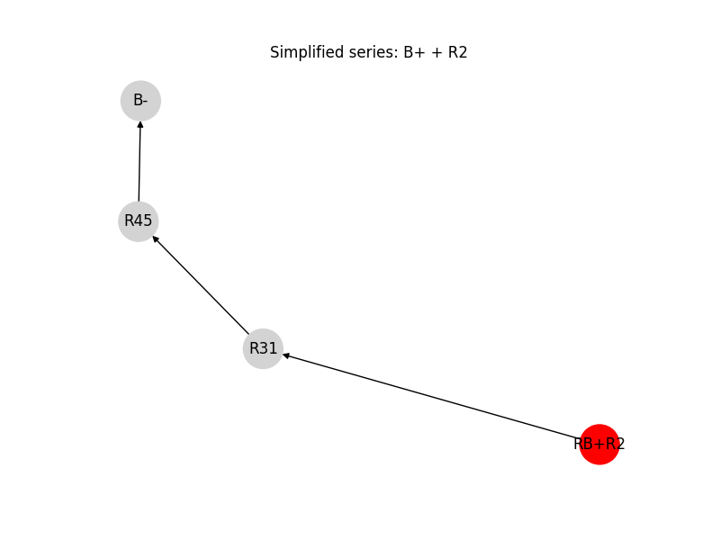
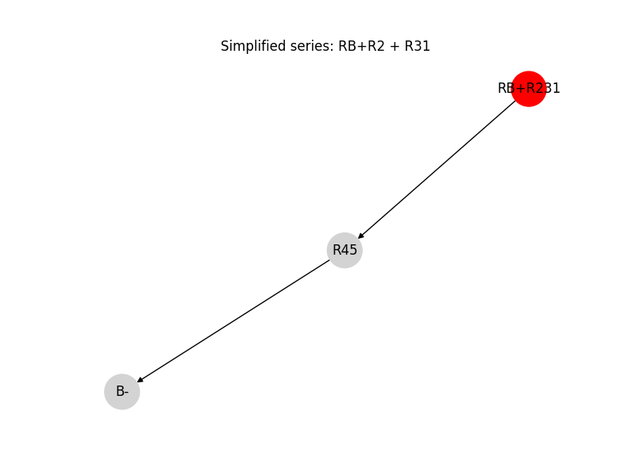
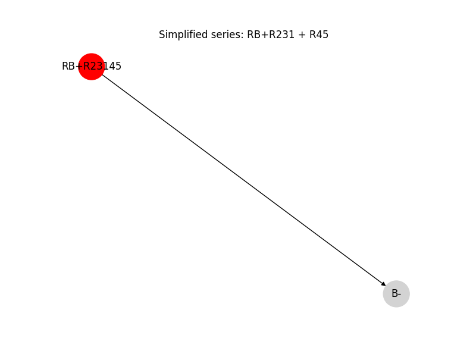
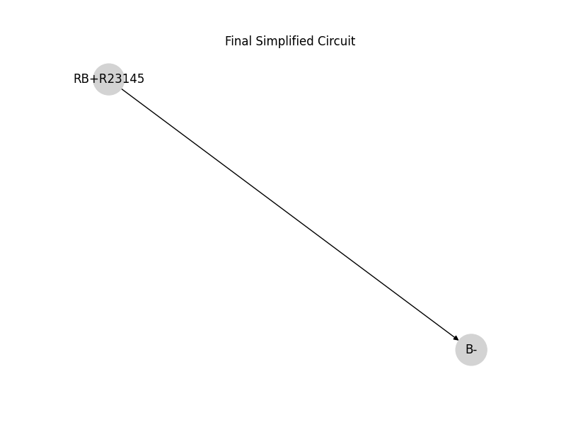

# Problem 1

# Equivalent Resistance Using Graph Theory

### Motivation

The **equivalent resistance** between two terminals (START and END) in an electrical network is a central concept in circuit analysis. While basic configurations can be handled with simple series and parallel rules, **complex circuits** with many junctions and loops require a more robust approach.

Using **graph theory**, we model the circuit as a graph where:
- **Nodes** represent junctions,
- **Edges** represent resistors,
- **Weights** on edges represent resistance values.

This transforms circuit simplification into a graph-reduction problem. The process can be fully automated and is essential for tasks like circuit simulation, network optimization, and computer-aided design.

---

## 1. Graph-Based Circuit Simplification

### Step-by-Step Approach

Given a weighted undirected graph:

- START and END are the terminals.
- Each edge $e_{ij}$ has a resistance $R_{ij}$.
- The goal is to compute a single equivalent resistance $R_{\text{eq}}$ between START and END.

We apply the following reduction rules iteratively:

---

### 1.1 Series Reduction

If a node (not START or END) has exactly two neighbors and connects only to them, its resistors are in **series**.

Replace this subgraph:

A -- R₁ -- B -- R₂ -- C


with:

A -- R₁₂ -- C


Where:

$$
R_{\text{eq}} = R_1 + R_2
$$

---

### 1.2 Parallel Reduction

If multiple resistors connect the same two nodes, they are in **parallel**.

Replace this:

A -- R₁ -- B
A -- R₂ -- B


with:

A -- R_{\text{eq}} -- B


Where:

$$
\frac{1}{R_{\text{eq}}} = \frac{1}{R_1} + \frac{1}{R_2}
$$

---

### 1.3 Iteration

Repeat series and parallel simplification until only one resistor remains between START and END:

$$
R_{\text{total}} = R_{\text{eq}}
$$

---

```python
import networkx as nx
import matplotlib.pyplot as plt
import itertools
from IPython.display import display, Image
import io

# Global step counter
step_counter = 0

# Initialize graph
G = nx.DiGraph()
edges = [
    ('B+', 'R2'), ('R2', 'R3'), ('R3', 'R4'), ('B+', 'R1'), ('R1', 'R4'),
    ('R4', 'R5'), ('R5', 'B-')
]
G.add_edges_from(edges)

def draw_graph(G, highlight_nodes=[], title="Step"):
    global step_counter
    print(f"Drawing graph: {title}") # Added print statement
    pos = nx.spring_layout(G, seed=42)
    fig, ax = plt.subplots(figsize=(8, 6))
    node_colors = ['red' if node in highlight_nodes else 'lightgray' for node in G.nodes()]
    nx.draw(G, pos, with_labels=True, arrows=True, node_color=node_colors, node_size=1000, ax=ax)
    plt.title(title)

    # Show inline
    buf = io.BytesIO()
    plt.savefig(buf, format='png')
    buf.seek(0)
    display(Image(data=buf.read()))
    plt.close()
    step_counter += 1

def find_series(G):
    for node in G.nodes():
        preds = list(G.predecessors(node))
        succs = list(G.successors(node))
        if len(preds) == 1 and len(succs) == 1:
            pred = preds[0]
            succ = succs[0]
            # Convert iterators to lists before checking length
            if len(list(G.successors(pred))) == 1 and len(list(G.predecessors(succ))) == 1:
                return pred, node
    return None


def find_parallel(G):
    checked = set()
    for u, v in G.edges():
        for w in G.predecessors(v):
            if w != u and G.has_edge(w, v) and (w, u, v) not in checked and (u, w, v) not in checked:
                checked.add((u, w, v))
                return u, w, v
    return None

# Draw initial
draw_graph(G, title="Initial Circuit")

# Simplify loop
while True:
    series = find_series(G)
    if series:
        u, v = series
        new_label = f"{u[1:]}{v[1:]}" if u.startswith("R") and v.startswith("R") else f"{u}{v}"
        succ = list(G.successors(v))[0]
        G.add_edge(u, succ)
        # Relabel the predecessor node to the new node label BEFORE removing the successor node
        G = nx.relabel_nodes(G, {u: f"R{new_label}"})
        G.remove_node(v)
        draw_graph(G, highlight_nodes=[f"R{new_label}"], title=f"Simplified series: {u} + {v}")
        continue

    parallel = find_parallel(G)
    if parallel:
        u1, u2, v = parallel
        new_label = f"{u1[1:]}{u2[1:]}" if u1.startswith("R") and u2.startswith("R") else f"{u1}{u2}"
        G.remove_edge(u1, v)
        G.remove_edge(u2, v)
        # Need to remove the nodes AFTER all edges connected to them are handled
        new_node = f"R{new_label}"
        G.add_edge(new_node, v)
        # Relabeling is done here to rename the first node of the parallel pair (u1) to the new node label
        # This assumes u1 will be the representative for the new combined node
        G = nx.relabel_nodes(G, {u1: new_node})
        # Remove the second node of the parallel pair
        G.remove_node(u2)
        draw_graph(G, highlight_nodes=[new_node], title=f"Simplified parallel: {u1} || {u2}")
        continue

    break

# Final
draw_graph(G, title="Final Simplified Circuit")
```









## 2. Python Algorithm

## Step 1: Original Circuit (with parallel and series resistors)

## 3. Example Analysis

Given the test circuit:

- START → A: $R = 2\,\Omega$
- A → B: $R = 3\,\Omega$ 
- B → END: $R = 4\,\Omega$  
- A → END: $R = 6\,\Omega$  

### Step-by-step:

1. Combine A–B and B–END (series):  
   $R_{\text{AB-END}} = 3 + 4 = 7\,\Omega$

2. A has two paths to END:  
   - One path is: $7\,\Omega$  
   - Other path is: $6\,\Omega$

3. Combine those in parallel:

   $$
   \frac{1}{R_{\text{eq}}} = \frac{1}{6} + \frac{1}{7} = \frac{13}{42}
   \Rightarrow R_{\text{eq}} \approx 3.23\,\Omega
   $$

4. Finally, add START–A:

   $$
   R_{\text{total}} = 2 + 3.23 = 5.23\,\Omega
   $$

---

## 4. Conclusion

We showed how to:

- Use graph theory to model electrical circuits.
- Detect and simplify series and parallel connections.
- Automate the process using Python and `networkx`.

This method scales well to arbitrarily complex networks and is highly applicable to modern engineering workflows such as simulation, layout, and optimization of electrical systems.
