# Problem 1

# Equivalent Resistance Using Graph Theory

### Motivation

The **equivalent resistance** between two terminals (START and END) in an electrical network is a central concept in circuit analysis. While basic configurations can be handled with simple series and parallel rules, **complex circuits** with many junctions and loops require a more robust approach.

Using **graph theory**, we model the circuit as a graph where:
- **Nodes** represent junctions,
- **Edges** represent resistors,
- **Weights** on edges represent resistance values.

This transforms circuit simplification into a graph-reduction problem. The process can be fully automated and is essential for tasks like circuit simulation, network optimization, and computer-aided design.

---

## 1. Graph-Based Circuit Simplification

### Step-by-Step Approach

Given a weighted undirected graph:

- START and END are the terminals.
- Each edge $e_{ij}$ has a resistance $R_{ij}$.
- The goal is to compute a single equivalent resistance $R_{\text{eq}}$ between START and END.

We apply the following reduction rules iteratively:

---

### 1.1 Series Reduction

If a node (not START or END) has exactly two neighbors and connects only to them, its resistors are in **series**.

Replace this subgraph:

A -- R₁ -- B -- R₂ -- C


with:

A -- R₁₂ -- C


Where:

$$
R_{\text{eq}} = R_1 + R_2
$$

---

### 1.2 Parallel Reduction

If multiple resistors connect the same two nodes, they are in **parallel**.

Replace this:

A -- R₁ -- B
A -- R₂ -- B


with:

$$A -- R_{\text{eq}} -- B$$


Where:

$$
\frac{1}{R_{\text{eq}}} = \frac{1}{R_1} + \frac{1}{R_2}
$$

---

### 1.3 Iteration

Repeat series and parallel simplification until only one resistor remains between START and END:

$$
R_{\text{total}} = R_{\text{eq}}
$$

---

```python
import networkx as nx
import matplotlib.pyplot as plt
from IPython.display import display, Image
import io

# Global step counter
step_counter = 0

# Initialize graph
G = nx.DiGraph()
edges = [
    ('B+', 'R2'), ('R2', 'R3'), ('R3', 'R4'), ('B+', 'R1'), ('R1', 'R4'),
    ('R4', 'R5'), ('R5', 'B-')
]
G.add_edges_from(edges)

def draw_graph(G, highlight_nodes=[], title="Step"):
    global step_counter
    print(f"Drawing graph: {title}")
    pos = nx.spring_layout(G, seed=42)
    fig, ax = plt.subplots(figsize=(8, 6))
    node_colors = ['red' if node in highlight_nodes else 'lightgray' for node in G.nodes()]
    nx.draw(G, pos, with_labels=True, arrows=True, node_color=node_colors, node_size=1000, ax=ax)
    plt.title(title)

    buf = io.BytesIO()
    plt.savefig(buf, format='png')
    buf.seek(0)
    display(Image(data=buf.read()))
    plt.close()
    step_counter += 1

# Step 1: Draw initial
draw_graph(G, title="Initial Circuit")

# === Step 2: Series Merge R2 + R3 -> R23 ===
G.add_edge('R23', 'R4')
G.remove_edge('R2', 'R3')
G.remove_edge('R3', 'R4')
G = nx.relabel_nodes(G, {'R2': 'R23'})
G.remove_node('R3')
draw_graph(G, highlight_nodes=['R23'], title="Series Merge: R2 + R3 → R23")

# === Step 3: Series Merge R4 + R5 -> R45 ===
G.add_edge('R45', 'B-')
G.remove_edge('R4', 'R5')
G.remove_edge('R5', 'B-')
G = nx.relabel_nodes(G, {'R4': 'R45'})
G.remove_node('R5')
draw_graph(G, highlight_nodes=['R45'], title="Series Merge: R4 + R5 → R45")

# === Step 4: Connect R1 and R23 directly to R45 if not already ===
# (This ensures all 3 are feeding into same node)
G.add_edge('R1', 'R45')
G.add_edge('R23', 'R45')

# === Step 5: Merge R1, R23, R45 (Parallel) → R12345 ===
# All three go from B+ to B-, now merge into single R12345
G.add_edge('R12345', 'B-')
G.remove_edge('R1', 'R45')
G.remove_edge('R23', 'R45')
G.remove_edge('R45', 'B-')
G = nx.relabel_nodes(G, {'R1': 'R12345'})
G.remove_node('R23')
G.remove_node('R45')
draw_graph(G, highlight_nodes=['R12345'], title="Parallel Merge: R1 || R23 || R45 → R12345")

# Final
draw_graph(G, title="Final Simplified Circuit")
```

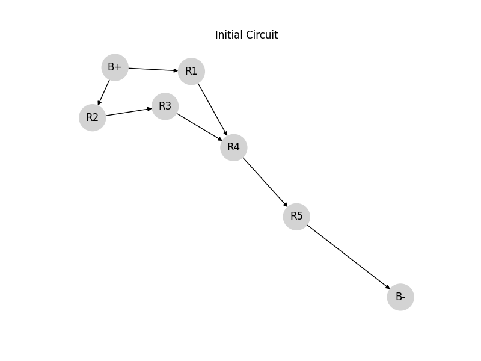
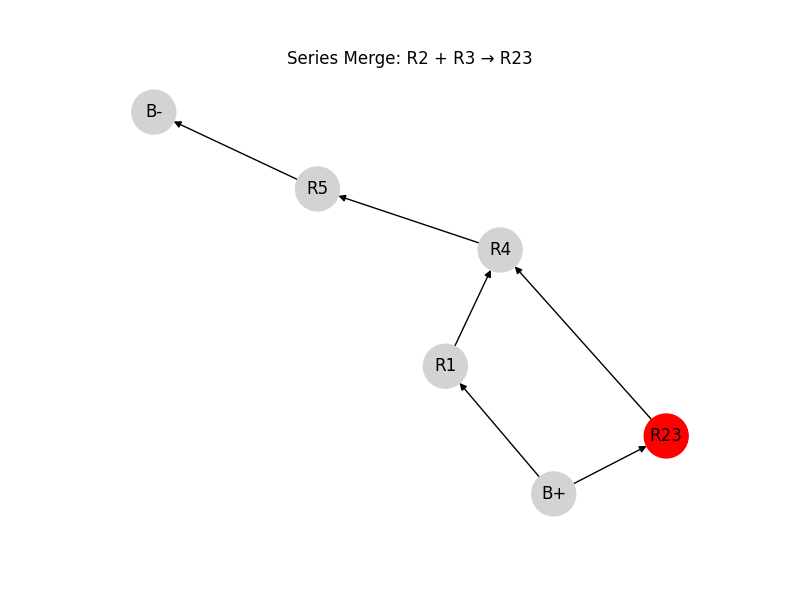
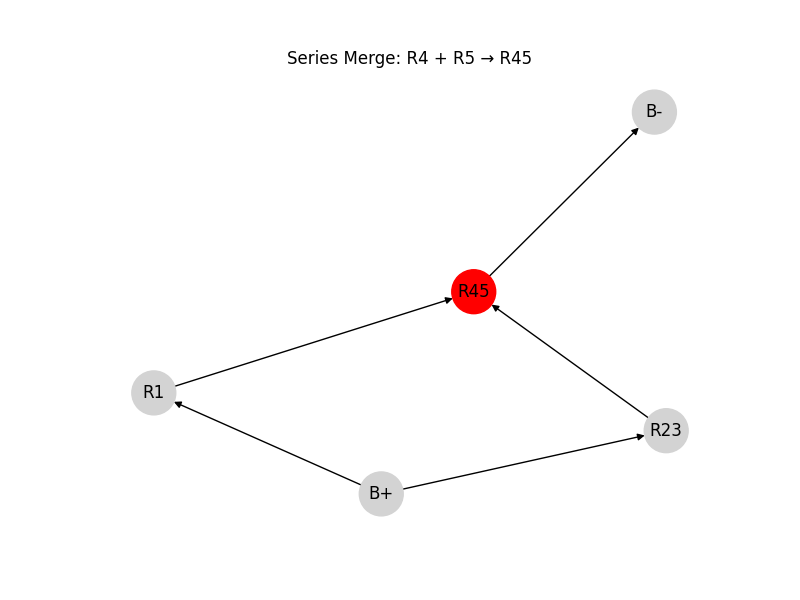
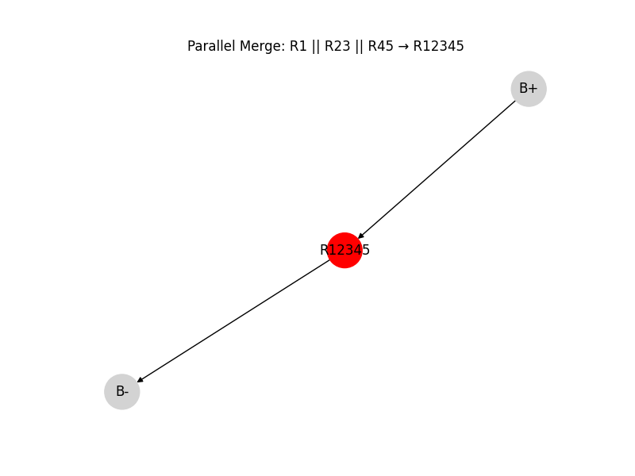
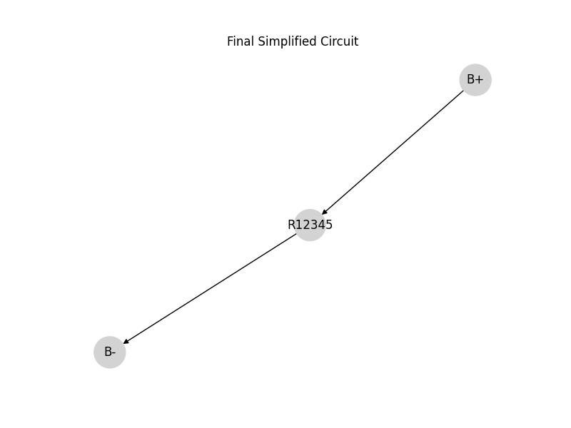

## 2. Python Algorithm

## Step 1: Original Circuit (with parallel and series resistors)

## 3. Example Analysis

Given the test circuit:

- START → A: $R = 2\,\Omega$
- A → B: $R = 3\,\Omega$ 
- B → END: $R = 4\,\Omega$  
- A → END: $R = 6\,\Omega$  

### Step-by-step:

1. Combine A–B and B–END (series):  
   $R_{\text{AB-END}} = 3 + 4 = 7\,\Omega$

2. A has two paths to END:  
   - One path is: $7\,\Omega$  
   - Other path is: $6\,\Omega$

3. Combine those in parallel:

   $$
   \frac{1}{R_{\text{eq}}} = \frac{1}{6} + \frac{1}{7} = \frac{13}{42}
   \Rightarrow R_{\text{eq}} \approx 3.23\,\Omega
   $$

4. Finally, add START–A:

   $$
   R_{\text{total}} = 2 + 3.23 = 5.23\,\Omega
   $$

---

```python
import networkx as nx
import matplotlib.pyplot as plt
import itertools
import warnings

warnings.filterwarnings("ignore", category=UserWarning)

def draw_graph(G, step, pos=None):
    if pos is None:
        pos = nx.spring_layout(G, seed=42)
    
    edge_labels = nx.get_edge_attributes(G, 'resistance')
    edge_labels = {(u, v): f"{r:.2f}Ω" for (u, v), r in edge_labels.items()}

    plt.figure(figsize=(6, 4))
    nx.draw_networkx_nodes(G, pos, node_color='skyblue', node_size=800)
    nx.draw_networkx_labels(G, pos, font_size=12, font_weight='bold')

    nx.draw_networkx_edges(G, pos, width=2)
    nx.draw_networkx_edge_labels(
        G, pos, edge_labels=edge_labels,
        font_size=10, label_pos=0.6,
        bbox=dict(facecolor='white', edgecolor='none', pad=0.5)
    )

    plt.title(f"Step {step}")
    plt.axis('off')
    plt.show()
    return pos  # return to reuse same layout

def reduce_parallel(G):
    changed = False
    seen = set()
    for u, v in list(G.edges()):
        if (u, v) in seen or (v, u) in seen:
            continue
        parallels = [e for e in G.edges([u, v]) if (e[0] == u and e[1] == v) or (e[0] == v and e[1] == u)]
        if len(parallels) > 1:
            resistances = [G.get_edge_data(x, y)['resistance'] for (x, y) in parallels]
            R_eq = 1 / sum(1 / R for R in resistances)
            G.remove_edges_from(parallels)
            G.add_edge(u, v, resistance=R_eq)
            changed = True
        seen.add((u, v))
    return changed

def reduce_series(G, start, end):
    changed = False
    for node in list(G.nodes()):
        if node in (start, end):
            continue
        if G.degree[node] == 2:
            neighbors = list(G.neighbors(node))
            if G.has_edge(neighbors[0], node) and G.has_edge(node, neighbors[1]):
                R1 = G[neighbors[0]][node]['resistance']
                R2 = G[node][neighbors[1]]['resistance']
                G.remove_node(node)
                G.add_edge(neighbors[0], neighbors[1], resistance=R1 + R2)
                changed = True
                break  # reprocess after change
    return changed

def equivalent_resistance(G, start, end):
    step = 0
    pos = draw_graph(G, step)  # use one layout
    while True:
        changed = False
        if reduce_parallel(G):
            step += 1
            pos = draw_graph(G, step, pos)
            changed = True
        if reduce_series(G, start, end):
            step += 1
            pos = draw_graph(G, step, pos)
            changed = True
        if not changed:
            break

    if G.has_edge(start, end):
        print(f"✅ Equivalent resistance between {start} and {end}: {G[start][end]['resistance']:.2f} Ω")
    else:
        print("⚠️ No path between start and end — open circuit.")

# --- Example Circuit ---

G = nx.Graph()
G.add_edge('A', 'B', resistance=2)
G.add_edge('B', 'C', resistance=3)
G.add_edge('B', 'C', resistance=6)
G.add_edge('C', 'D', resistance=4)

start, end = 'A', 'D'
equivalent_resistance(G, start, end)
```

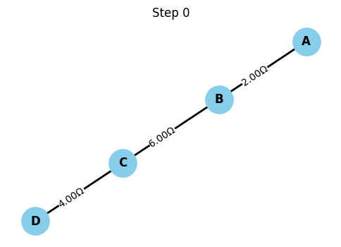
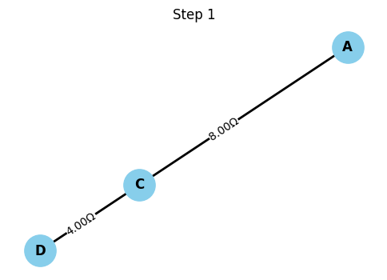
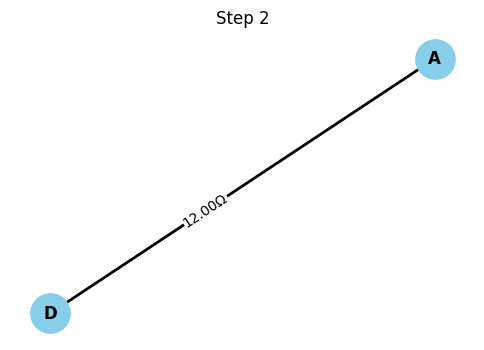


```python
import networkx as nx
import matplotlib.pyplot as plt

def draw_circuit(G, step_title):
    pos = nx.spring_layout(G, seed=42)
    # Correctly handle edge labels for MultiGraph
    labels = {(u, v): f"{data['resistance']:.2f}Ω" for u, v, key, data in G.edges(keys=True, data=True) if 'resistance' in data}

    plt.figure(figsize=(6, 4))
    nx.draw(G, pos, with_labels=True, node_color='skyblue', node_size=800, font_weight='bold')
    nx.draw_networkx_edge_labels(G, pos, edge_labels=labels)
    plt.title(step_title)
    plt.axis('off')
    plt.show()

def combine_series_with_steps(G, start, end, step):
    changed = True
    while changed:
        changed = False
        for node in list(G.nodes):
            if node in (start, end):
                continue
            # Check if node has exactly two neighbors and is not connected to itself
            if G.degree[node] == 2 and len(list(G.neighbors(node))) == 2:
                neighbors = list(G.neighbors(node))
                # Check if there is a single edge between node and each neighbor
                if len(G.get_edge_data(neighbors[0], node)) == 1 and len(G.get_edge_data(node, neighbors[1])) == 1:
                     # Get the resistance from the single edge
                    R1 = list(G.get_edge_data(neighbors[0], node).values())[0]['resistance']
                    R2 = list(G.get_edge_data(node, neighbors[1]).values())[0]['resistance']
                    req = R1 + R2
                    print(f"🔗 Series merge: {R1}Ω + {R2}Ω = {req}Ω between {neighbors[0]}–{neighbors[1]} (via {node})")
                    G.remove_node(node)
                    # Check if an edge already exists between neighbors[0] and neighbors[1]
                    if G.has_edge(neighbors[0], neighbors[1]):
                        # If an edge exists, combine in parallel
                        existing_resistances = [d['resistance'] for key, d in G.get_edge_data(neighbors[0], neighbors[1]).items()]
                        existing_resistances.append(req)
                        combined_resistance = 1 / sum(1 / r for r in existing_resistances)
                        # Remove all existing edges between neighbors[0] and neighbors[1]
                        for key in list(G[neighbors[0]][neighbors[1]].keys()):
                            G.remove_edge(neighbors[0], neighbors[1], key=key)
                        G.add_edge(neighbors[0], neighbors[1], resistance=combined_resistance)
                    else:
                        G.add_edge(neighbors[0], neighbors[1], resistance=req)

                    step[0] += 1
                    draw_circuit(G, f"Step {step[0]}: Series merged {neighbors[0]}–{neighbors[1]}")
                    changed = True
                    break
    return G

def combine_parallel_with_steps(G, step):
    changed = True
    while changed:
        changed = False
        seen = set()
        # Correctly iterate over edges for MultiGraph
        for u, v, key in list(G.edges(keys=True)):
            if (u, v) in seen or (v, u) in seen:
                continue
            # Use list(G.get_edge_data(u, v, default={}).items()) to get data for all edges between u and v
            edges_data = list(G.get_edge_data(u, v, default={}).items())
            if len(edges_data) > 1:
                resistances = [d['resistance'] for key, d in edges_data]
                req = 1 / sum(1 / r for r in resistances)
                print(f"🔀 Parallel merge: {' || '.join(f'{r}Ω' for r in resistances)} = {req:.2f}Ω between {u}–{v}")
                # Remove edges by key
                G.remove_edges_from([(u, v, key) for key, _ in edges_data])
                G.add_edge(u, v, resistance=req)
                seen.add((u, v))
                step[0] += 1
                draw_circuit(G, f"Step {step[0]}: Parallel merged {u}–{v}")
                changed = True
    return G


def simplify_and_plot_step_by_step(G, start, end):
    step = [1]
    draw_circuit(G, f"Step {step[0]}: Original Circuit")
    while True:
        old_edges = list(G.edges(data=True, keys=True)) # Include keys in comparison
        G = combine_series_with_steps(G, start, end, step)
        G = combine_parallel_with_steps(G, step)
        new_edges = list(G.edges(data=True, keys=True)) # Include keys in comparison
        if old_edges == new_edges:
            break

    # Final step: show total resistance
    # Handle multiple edges between start and end after reduction
    if G.has_edge(start, end):
        if isinstance(G, nx.MultiGraph):
            total_conductance = sum(1/data['resistance'] for u, v, key, data in G.edges(keys=True, data=True) if {u, v} == {start, end})
            total_resistance = 1 / total_conductance if total_conductance > 0 else float('inf')
        else:
            total_resistance = G.edges[start, end]['resistance']
    else:
        total_resistance = float('inf')  # Open circuit


    if total_resistance is not None:
        step[0] += 1
        draw_circuit(G, f"Step {step[0]}: Final Equivalent Resistance = {total_resistance:.2f}Ω")
        print(f"\n⚡ Final Total Resistance between {start} and {end}: {total_resistance:.2f}Ω")

    return G

# Build the original circuit as a MultiGraph
G = nx.MultiGraph()
G.add_edge('START', 'A', resistance=2)
G.add_edge('A', 'B', resistance=4)
G.add_edge('B', 'END', resistance=6)

G.add_edge('START', 'X', resistance=3)
G.add_edge('X', 'Y', resistance=5)
G.add_edge('Y', 'END', resistance=7)

start, end = 'START', 'END'

# Simplify and visualize
final_G = simplify_and_plot_step_by_step(G.copy(), start, end) # Pass a copy to avoid modifying the original example graph
```

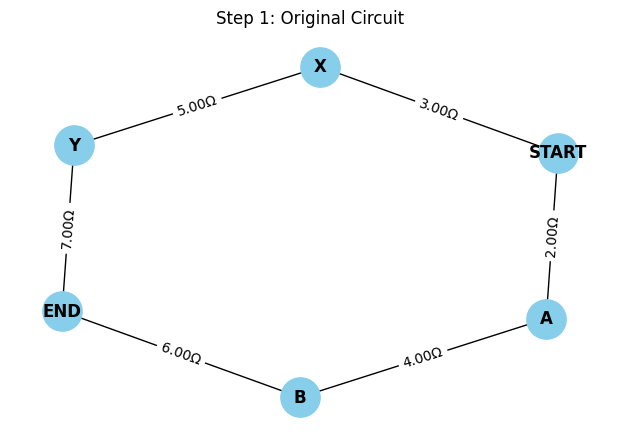
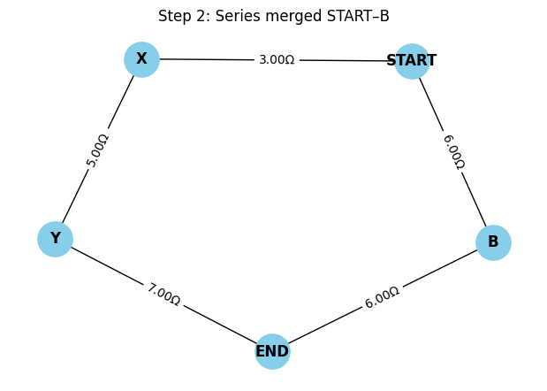
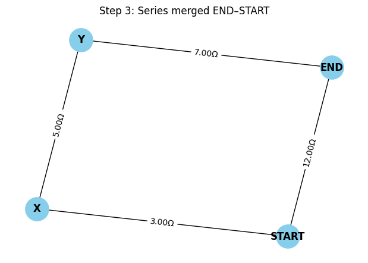
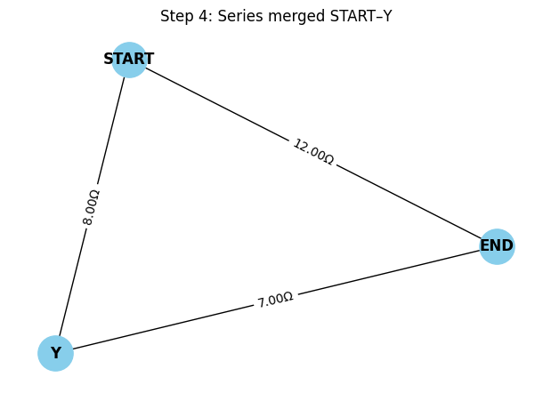
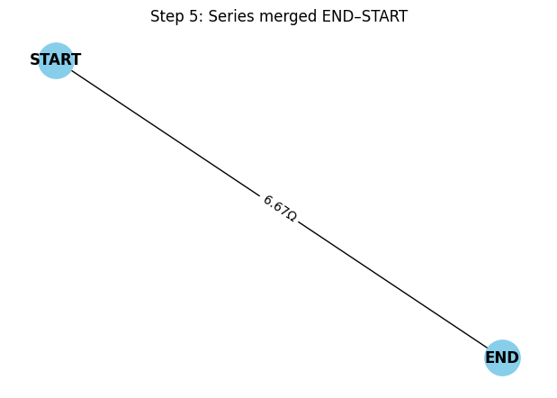


```python
import networkx as nx
import matplotlib.pyplot as plt

# ✅ Improved draw_circuit: shows multiple resistors on same edge (e.g., "3.00Ω, 7.00Ω")
def draw_circuit(G, step_title, step_num):
    pos = nx.spring_layout(G, seed=42)

    # Build edge labels that account for multiple resistors (parallel edges)
    edge_labels = {}
    for u, v in G.edges():
        resistances = [
            f"{data['resistance']:.2f}Ω"
            for key, data in G.get_edge_data(u, v).items()
            if 'resistance' in data
        ]
        edge_labels[(u, v)] = ", ".join(resistances)

    plt.figure(figsize=(6, 4))
    nx.draw(G, pos, with_labels=True, node_color='skyblue', node_size=800, font_weight='bold')
    nx.draw_networkx_edge_labels(G, pos, edge_labels=edge_labels)
    plt.title(f"Step {step_num}: {step_title}")
    plt.axis('off')
    plt.show()

def combine_series_with_steps(G, start, end, step):
    changed = True
    while changed:
        changed = False
        for node in list(G.nodes):
            if node in (start, end):
                continue
            if G.degree[node] == 2 and len(list(G.neighbors(node))) == 2:
                neighbors = list(G.neighbors(node))
                if len(G.get_edge_data(neighbors[0], node)) == 1 and len(G.get_edge_data(node, neighbors[1])) == 1:
                    R1 = list(G.get_edge_data(neighbors[0], node).values())[0]['resistance']
                    R2 = list(G.get_edge_data(node, neighbors[1]).values())[0]['resistance']
                    req = R1 + R2
                    print(f"🔗 Series merge: {R1}Ω + {R2}Ω = {req}Ω between {neighbors[0]}–{neighbors[1]} (via {node})")
                    G.remove_node(node)
                    if G.has_edge(neighbors[0], neighbors[1]):
                        existing_resistances = [d['resistance'] for key, d in G.get_edge_data(neighbors[0], neighbors[1]).items()]
                        existing_resistances.append(req)
                        combined_resistance = 1 / sum(1 / r for r in existing_resistances)
                        for key in list(G[neighbors[0]][neighbors[1]].keys()):
                            G.remove_edge(neighbors[0], neighbors[1], key=key)
                        G.add_edge(neighbors[0], neighbors[1], resistance=combined_resistance)
                    else:
                        G.add_edge(neighbors[0], neighbors[1], resistance=req)

                    step[0] += 1
                    draw_circuit(G, f"Series merged {neighbors[0]}–{neighbors[1]}", step[0])
                    changed = True
                    break
    return G

def combine_parallel_with_steps(G, step):
    changed = True
    while changed:
        changed = False
        seen = set()
        for u, v, key in list(G.edges(keys=True)):
            if (u, v) in seen or (v, u) in seen:
                continue
            edges_data = list(G.get_edge_data(u, v, default={}).items())
            if len(edges_data) > 1:
                resistances = [d['resistance'] for key, d in edges_data]
                req = 1 / sum(1 / r for r in resistances)
                print(f"🔀 Parallel merge: {' || '.join(f'{r}Ω' for r in resistances)} = {req:.2f}Ω between {u}–{v}")
                G.remove_edges_from([(u, v, key) for key, _ in edges_data])
                G.add_edge(u, v, resistance=req)
                seen.add((u, v))
                step[0] += 1
                draw_circuit(G, f"Parallel merged {u}–{v}", step[0])
                changed = True
    return G

def simplify_and_plot_step_by_step(G, start, end):
    step = [1]
    draw_circuit(G, "Original Circuit", step[0])
    while True:
        old_edges = list(G.edges(data=True, keys=True))
        G = combine_series_with_steps(G, start, end, step)
        G = combine_parallel_with_steps(G, step)
        new_edges = list(G.edges(data=True, keys=True))
        if old_edges == new_edges:
            break

    if G.has_edge(start, end):
        if isinstance(G, nx.MultiGraph):
            total_conductance = sum(
                1/data['resistance'] 
                for u, v, key, data in G.edges(keys=True, data=True) 
                if {u, v} == {start, end}
            )
            total_resistance = 1 / total_conductance if total_conductance > 0 else float('inf')
        else:
            total_resistance = G.edges[start, end]['resistance']
    else:
        total_resistance = float('inf')

    step[0] += 1
    draw_circuit(G, f"Final Equivalent Resistance = {total_resistance:.2f}Ω", step[0])
    print(f"\n⚡ Final Total Resistance between {start} and {end}: {total_resistance:.2f}Ω")
    return G

# 🧩 New circuit with both series and parallel paths
G = nx.MultiGraph()

# Main series path
G.add_edge('START', 'A', resistance=2)
G.add_edge('A', 'B', resistance=3)
G.add_edge('B', 'END', resistance=5)

# Parallel branch: A–C–D–END
G.add_edge('A', 'C', resistance=6)
G.add_edge('C', 'D', resistance=2)
G.add_edge('D', 'END', resistance=4)

start, end = 'START', 'END'

# 🚀 Run simplification with step-by-step visualization
final_G = simplify_and_plot_step_by_step(G.copy(), start, end)
```

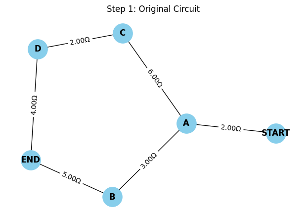
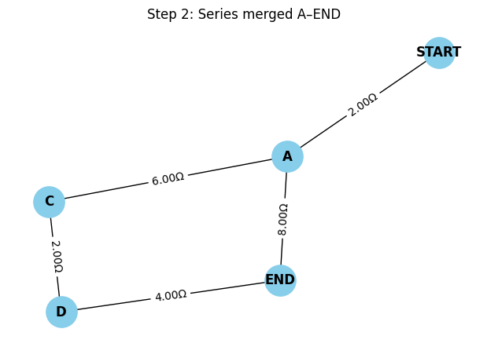
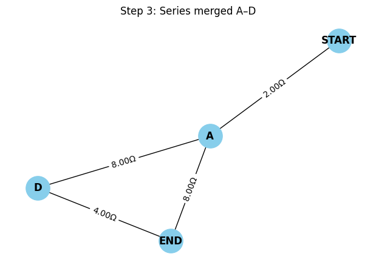
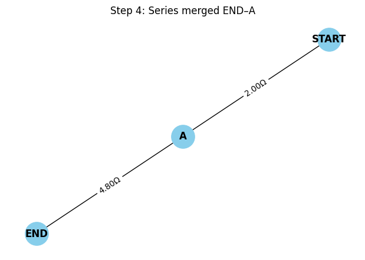
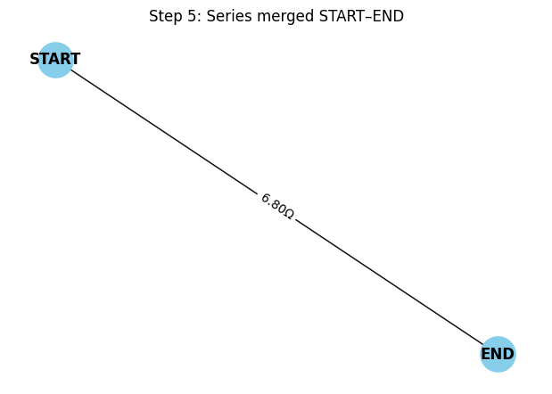
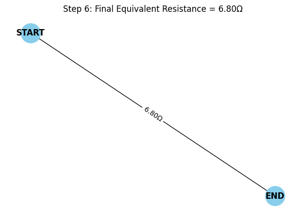

## 4. Conclusion

We showed how to:

- Use graph theory to model electrical circuits.
- Detect and simplify series and parallel connections.
- Automate the process using Python and `networkx`.

This method scales well to arbitrarily complex networks and is highly applicable to modern engineering workflows such as simulation, layout, and optimization of electrical systems.
