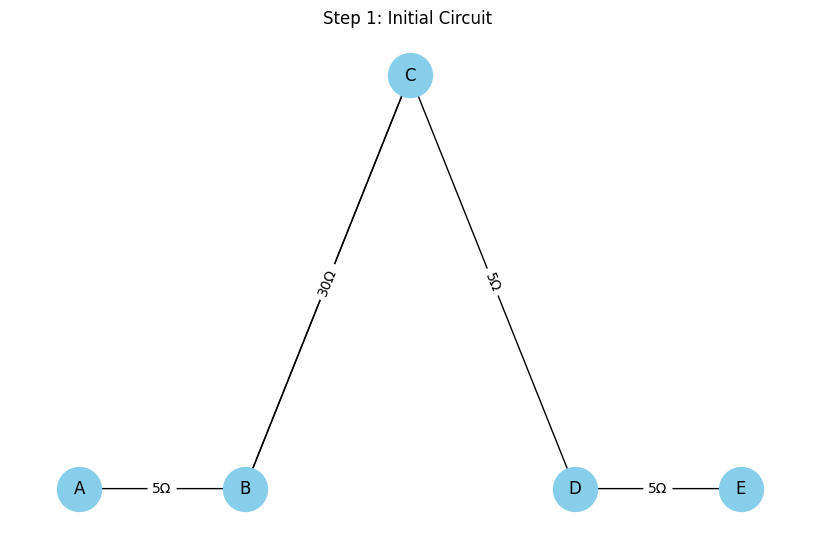
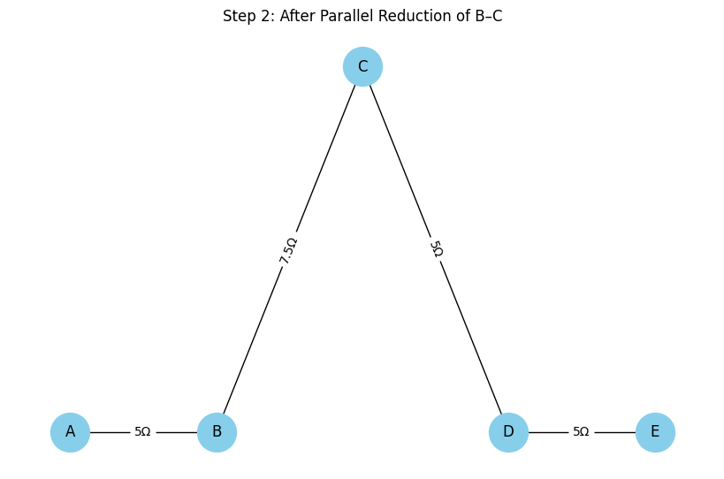
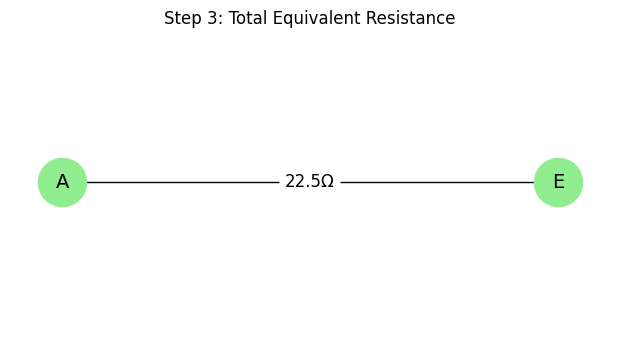

# Problem 1

# Equivalent Resistance Using Graph Theory

### Motivation

The **equivalent resistance** between two terminals (START and END) in an electrical network is a central concept in circuit analysis. While basic configurations can be handled with simple series and parallel rules, **complex circuits** with many junctions and loops require a more robust approach.

Using **graph theory**, we model the circuit as a graph where:
- **Nodes** represent junctions,
- **Edges** represent resistors,
- **Weights** on edges represent resistance values.

This transforms circuit simplification into a graph-reduction problem. The process can be fully automated and is essential for tasks like circuit simulation, network optimization, and computer-aided design.

---

## 1. Graph-Based Circuit Simplification

### Step-by-Step Approach

Given a weighted undirected graph:

- START and END are the terminals.
- Each edge $e_{ij}$ has a resistance $R_{ij}$.
- The goal is to compute a single equivalent resistance $R_{\text{eq}}$ between START and END.

We apply the following reduction rules iteratively:

---

### 1.1 Series Reduction

If a node (not START or END) has exactly two neighbors and connects only to them, its resistors are in **series**.

Replace this subgraph:

A -- R₁ -- B -- R₂ -- C


with:

A -- R₁₂ -- C


Where:

$$
R_{\text{eq}} = R_1 + R_2
$$

---

### 1.2 Parallel Reduction

If multiple resistors connect the same two nodes, they are in **parallel**.

Replace this:

A -- R₁ -- B
A -- R₂ -- B


with:

A -- R_{\text{eq}} -- B


Where:

$$
\frac{1}{R_{\text{eq}}} = \frac{1}{R_1} + \frac{1}{R_2}
$$

---

### 1.3 Iteration

Repeat series and parallel simplification until only one resistor remains between START and END:

$$
R_{\text{total}} = R_{\text{eq}}
$$

---

## 2. Python Algorithm

This Python implementation uses `networkx` to represent the circuit as a graph.

```python
import networkx as nx
import matplotlib.pyplot as plt

# Create a MultiGraph representing the red diagram circuit
G = nx.MultiGraph()

# Define the edges with resistances
edges = [
    ("A", "B", 5),
    ("B", "C", 10),
    ("B", "C", 30),  # Parallel with the above
    ("C", "D", 5),
    ("D", "E", 5)
]

# Add edges with resistance as attribute
for u, v, r in edges:
    G.add_edge(u, v, resistance=r)

# Position for nodes
pos = {
    "A": (0, 1),
    "B": (1, 1),
    "C": (2, 1.5),
    "D": (3, 1),
    "E": (4, 1)
}

# Draw the original graph
plt.figure(figsize=(8, 5))
nx.draw(G, pos, with_labels=True, node_color="skyblue", node_size=1000, font_size=12)

# Draw edge labels
edge_labels = {}
for u, v, data in G.edges(data=True):
    key = (u, v) if (u, v) not in edge_labels else (v, u)
    if key in edge_labels:
        edge_labels[key] += f", {data['resistance']}Ω"
    else:
        edge_labels[key] = f"{data['resistance']}Ω"

nx.draw_networkx_edge_labels(G, pos, edge_labels=edge_labels, font_size=10)
plt.title("Step 1: Initial Circuit ")
plt.axis("off")
plt.tight_layout()
plt.show()
```



```python
# Calculate the equivalent resistance of the two parallel resistors between B and C
R_parallel = 1 / (1/10 + 1/30)  # Parallel: 10Ω and 30Ω
R_parallel = round(R_parallel, 2)

# Create a new graph for Step 2: After parallel reduction
G2 = nx.Graph()
edges2 = [
    ("A", "B", 5),
    ("B", "C", R_parallel),
    ("C", "D", 5),
    ("D", "E", 5)
]

for u, v, r in edges2:
    G2.add_edge(u, v, resistance=r)

# Draw the reduced graph after parallel combination
plt.figure(figsize=(8, 5))
nx.draw(G2, pos, with_labels=True, node_color="skyblue", node_size=1000, font_size=12)

edge_labels2 = {(u, v): f"{d['resistance']}Ω" for u, v, d in G2.edges(data=True)}
nx.draw_networkx_edge_labels(G2, pos, edge_labels=edge_labels2, font_size=10)
plt.title("Step 2: After Parallel Reduction of B–C")
plt.axis("off")
plt.tight_layout()
plt.show()
```



```python
# Compute total equivalent resistance in the series
R_total = 5 + R_parallel + 5 + 5  # A-B, B-C, C-D, D-E
R_total = round(R_total, 2)

# Create a simplified linear graph showing total equivalent resistance
G3 = nx.Graph()
G3.add_edge("A", "E", resistance=R_total)

# Position for nodes A and E only
pos3 = {"A": (0, 1), "E": (2, 1)}

# Draw the final equivalent circuit
plt.figure(figsize=(6, 3))
nx.draw(G3, pos3, with_labels=True, node_color="lightgreen", node_size=1200, font_size=14)
edge_labels3 = {("A", "E"): f"{R_total}Ω"}
nx.draw_networkx_edge_labels(G3, pos3, edge_labels=edge_labels3, font_size=12)
plt.title("Step 3: Total Equivalent Resistance")
plt.axis("off")
plt.tight_layout()
plt.show()
```




## 3. Example Analysis

Given the test circuit:

- START → A: $R = 2\,\Omega$
- A → B: $R = 3\,\Omega$ 
- B → END: $R = 4\,\Omega$  
- A → END: $R = 6\,\Omega$  

### Step-by-step:

1. Combine A–B and B–END (series):  
   $R_{\text{AB-END}} = 3 + 4 = 7\,\Omega$

2. A has two paths to END:  
   - One path is: $7\,\Omega$  
   - Other path is: $6\,\Omega$

3. Combine those in parallel:

   $$
   \frac{1}{R_{\text{eq}}} = \frac{1}{6} + \frac{1}{7} = \frac{13}{42}
   \Rightarrow R_{\text{eq}} \approx 3.23\,\Omega
   $$

4. Finally, add START–A:

   $$
   R_{\text{total}} = 2 + 3.23 = 5.23\,\Omega
   $$

---

## 4. Conclusion

We showed how to:

- Use graph theory to model electrical circuits.
- Detect and simplify series and parallel connections.
- Automate the process using Python and `networkx`.

This method scales well to arbitrarily complex networks and is highly applicable to modern engineering workflows such as simulation, layout, and optimization of electrical systems.
