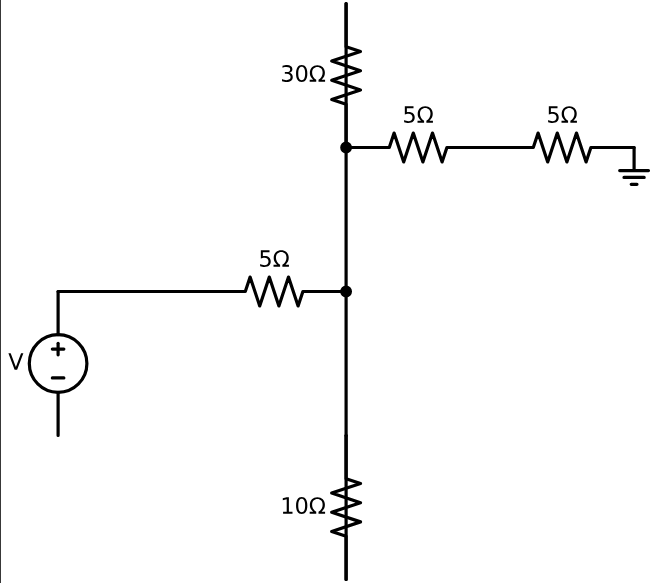
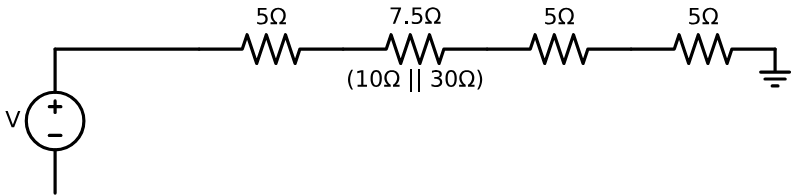
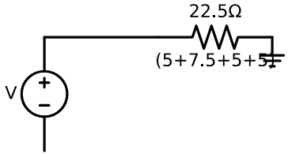

# Problem 1

# Equivalent Resistance Using Graph Theory

### Motivation

The **equivalent resistance** between two terminals (START and END) in an electrical network is a central concept in circuit analysis. While basic configurations can be handled with simple series and parallel rules, **complex circuits** with many junctions and loops require a more robust approach.

Using **graph theory**, we model the circuit as a graph where:
- **Nodes** represent junctions,
- **Edges** represent resistors,
- **Weights** on edges represent resistance values.

This transforms circuit simplification into a graph-reduction problem. The process can be fully automated and is essential for tasks like circuit simulation, network optimization, and computer-aided design.

---

## 1. Graph-Based Circuit Simplification

### Step-by-Step Approach

Given a weighted undirected graph:

- START and END are the terminals.
- Each edge $e_{ij}$ has a resistance $R_{ij}$.
- The goal is to compute a single equivalent resistance $R_{\text{eq}}$ between START and END.

We apply the following reduction rules iteratively:

---

### 1.1 Series Reduction

If a node (not START or END) has exactly two neighbors and connects only to them, its resistors are in **series**.

Replace this subgraph:

A -- R₁ -- B -- R₂ -- C


with:

A -- R₁₂ -- C


Where:

$$
R_{\text{eq}} = R_1 + R_2
$$

---

### 1.2 Parallel Reduction

If multiple resistors connect the same two nodes, they are in **parallel**.

Replace this:

A -- R₁ -- B
A -- R₂ -- B


with:

A -- R_{\text{eq}} -- B


Where:

$$
\frac{1}{R_{\text{eq}}} = \frac{1}{R_1} + \frac{1}{R_2}
$$

---

### 1.3 Iteration

Repeat series and parallel simplification until only one resistor remains between START and END:

$$
R_{\text{total}} = R_{\text{eq}}
$$

---

## 2. Python Algorithm

## Step 1: Original Circuit (with parallel and series resistors)

```python
!pip install schemdraw

import schemdraw
import schemdraw.elements as elm

# Step 1: Original Circuit
with schemdraw.Drawing() as d:
    d.config(unit=2.5)

    d += elm.SourceV().up().label('V', loc='top')
    d += elm.Line().right()
    d += elm.Resistor().label('5Ω').right()
    d += elm.Dot()
    d.push()
    d += elm.Line().down()
    d += elm.Resistor().label('10Ω')
    d += elm.Line().up()
    d.pop()
    d += elm.Line().up()
    d += elm.Resistor().label('30Ω')
    d += elm.Line().down()
    d += elm.Dot()
    d += elm.Resistor().label('5Ω').right()
    d += elm.Resistor().label('5Ω').right()
    d += elm.Ground()
```



## Step 2: After Parallel Reduction 

```python
import schemdraw
import schemdraw.elements as elm

# Step 2: Parallel Resistors Replaced with Equivalent
with schemdraw.Drawing() as d:
    d.config(unit=2.5)

    d += elm.SourceV().up().label('V', loc='top')
    d += elm.Line().right()
    d += elm.Resistor().label('5Ω').right()
    d += elm.Resistor().label('7.5Ω').right().label('(10Ω || 30Ω)', loc='bottom')
    d += elm.Resistor().label('5Ω').right()
    d += elm.Resistor().label('5Ω').right()
    d += elm.Ground()
```



## Step 3: Final Equivalent Resistance Only

```python
import schemdraw
import schemdraw.elements as elm

# Step 3: Fully Reduced to One Equivalent Resistor
with schemdraw.Drawing() as d:
    d.config(unit=2.5)

    d += elm.SourceV().up().label('V', loc='top')
    d += elm.Line().right()
    d += elm.Resistor().label('22.5Ω').right().label('(5+7.5+5+5)', loc='bottom')
    d += elm.Ground()
```



## 3. Example Analysis

Given the test circuit:

- START → A: $R = 2\,\Omega$
- A → B: $R = 3\,\Omega$ 
- B → END: $R = 4\,\Omega$  
- A → END: $R = 6\,\Omega$  

### Step-by-step:

1. Combine A–B and B–END (series):  
   $R_{\text{AB-END}} = 3 + 4 = 7\,\Omega$

2. A has two paths to END:  
   - One path is: $7\,\Omega$  
   - Other path is: $6\,\Omega$

3. Combine those in parallel:

   $$
   \frac{1}{R_{\text{eq}}} = \frac{1}{6} + \frac{1}{7} = \frac{13}{42}
   \Rightarrow R_{\text{eq}} \approx 3.23\,\Omega
   $$

4. Finally, add START–A:

   $$
   R_{\text{total}} = 2 + 3.23 = 5.23\,\Omega
   $$

---

## 4. Conclusion

We showed how to:

- Use graph theory to model electrical circuits.
- Detect and simplify series and parallel connections.
- Automate the process using Python and `networkx`.

This method scales well to arbitrarily complex networks and is highly applicable to modern engineering workflows such as simulation, layout, and optimization of electrical systems.
