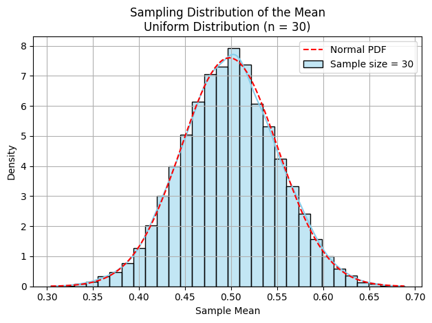

# Problem 1

# Exploring the Central Limit Theorem through Simulations

### Motivation

The Central Limit Theorem (CLT) is a foundational principle in statistics. It asserts that the distribution of sample means approaches a normal distribution as the sample size increases, regardless of the original distribution's shape. This property has profound implications in statistics and real-world applications. Through simulation, we can vividly observe the CLT in action, enhancing both understanding and intuition.

### 1. Simulating Sampling Distributions

To explore the CLT, we simulate sampling distributions using the following population distributions:

- Uniform Distribution: A distribution where every value within a specified range is equally likely. Its probability density function (PDF) is constant within the interval.

- Exponential Distribution: A continuous probability distribution commonly used to model time between events in a Poisson process. It is defined by the formula:
   
$$
f(x; \lambda) = \lambda e^{-\lambda x}, \quad x \geq 0
$$
- Binomial Distribution: A discrete distribution that represents the number of successes in a fixed number of independent Bernoulli trials with the same probability of success:

$$
P(X = k) = \binom{n}{k} p^k (1 - p)^{n - k}
$$

We generate a large synthetic population (e.g., 100,000 samples) for each distribution:


### 2. Sampling and Visualization
# Sample Mean

The sample mean is the average of a sample:

The sample mean is defined as:

$$
\bar{x} = \frac{1}{n} \sum_{i=1}^{n} x_i
$$

### Sampling Distribution

The sampling distribution of the sample mean is the probability distribution of all possible means from samples of a given size from the population.

```python
import numpy as np
import matplotlib.pyplot as plt
import seaborn as sns
from scipy.stats import norm

# Set the random seed for reproducibility
np.random.seed(0)

# ----------------------------
# 1. Generate Populations
# ----------------------------

# Uniform Distribution: U(0, 1)
pop_uniform = np.random.uniform(0, 1, 100000)

# Exponential Distribution: λ = 1
pop_exponential = np.random.exponential(scale=1.0, size=100000)

# Binomial Distribution: n = 10, p = 0.5
pop_binomial = np.random.binomial(n=10, p=0.5, size=100000)

# ----------------------------
# 2. Sampling and Visualization Function
# ----------------------------

def plot_sampling_distribution(population, sample_sizes, dist_name):
    """
    Plots the sampling distribution of the mean for various sample sizes.
    """
    for n in sample_sizes:
        # Generate 10,000 sample means
        sample_means = [np.mean(np.random.choice(population, size=n, replace=False)) for _ in range(10000)]

        # Plot histogram
        sns.histplot(sample_means, kde=True, stat="density", bins=30, color="skyblue", label=f"Sample size = {n}")
        
        # Overlay normal curve
        mu, sigma = np.mean(sample_means), np.std(sample_means)
        x = np.linspace(min(sample_means), max(sample_means), 100)
        plt.plot(x, norm.pdf(x, mu, sigma), 'r--', label="Normal PDF")

        # Labels and title
        plt.title(f"Sampling Distribution of the Mean\n{dist_name} Distribution (n = {n})")
        plt.xlabel("Sample Mean")
        plt.ylabel("Density")
        plt.legend()
        plt.grid(True)
        plt.tight_layout()
        plt.show()

# ----------------------------
# 3. Run Simulations
# ----------------------------

sample_sizes = [5, 10, 30, 50]

plot_sampling_distribution(pop_uniform, sample_sizes, "Uniform")
plot_sampling_distribution(pop_exponential, sample_sizes, "Exponential")
plot_sampling_distribution(pop_binomial, sample_sizes, "Binomial")
```




Run the plots for different sample sizes.
As the sample size increases, the sampling distribution becomes more bell-shaped and symmetric, illustrating convergence to normality.

### 3. Parameter Exploration

We examine how:

    The shape of the original distribution affects the speed of convergence.

    The sample size influences the accuracy and spread of the sample mean.

    The variance of the population affects the spread of the sampling distribution.

### Variance

The variance of the population ($\sigma^2$) measures the dispersion from the mean. The variance of the sampling distribution of the mean is:

$$
\text{Var}(\bar{x}) = \frac{\sigma^2}{n}
$$

### Expectations

    The more skewed the original distribution, the larger the sample size needed for convergence.

    Uniform distributions converge more rapidly than exponential ones.

### 4. Practical Applications

Understanding the CLT is essential in fields such as:

    Statistics: Confidence intervals and hypothesis testing rely on CLT.

    Manufacturing: Used in quality control to assess process stability.

    Finance: CLT helps model and assess risk using aggregated returns.

    Medical Trials: Helps ensure reliability of results from sampled patient data.

### Deliverables

    A Python script or notebook with simulations using NumPy, Matplotlib, and Seaborn.

    Plots illustrating sampling distributions from different population types.

    Mathematical definitions embedded next to each plot and concept.

    A Markdown discussion relating simulation results to theoretical expectations.

Code Hints

    Use numpy.random to generate populations and samples.

    Plot with seaborn.histplot() and overlay a normal curve using scipy.stats.norm.pdf.

    Use np.random.seed() for reproducibility.

### Conclusion

The Central Limit Theorem, though abstract in theory, becomes intuitive through computational experiments. Simulations show that regardless of the population’s distribution, the mean of sufficiently large samples tends to be normally distributed. This underpins much of statistical inference, from confidence intervals to decision-making models. Each plot is supported by mathematical definitions to reinforce learning and interpretation.
