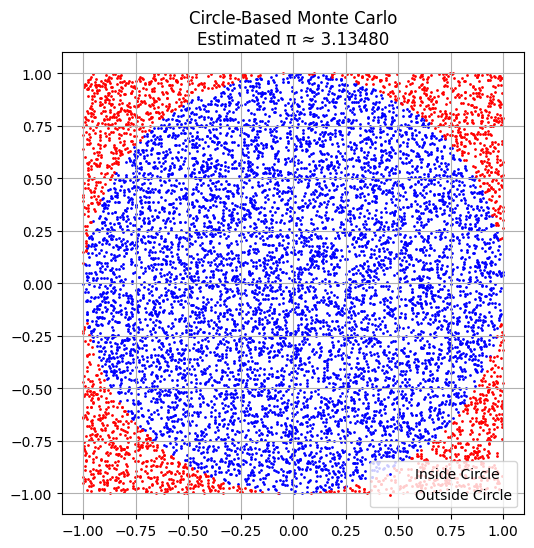
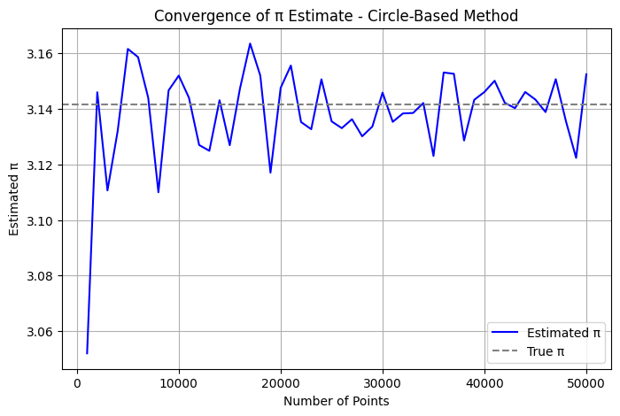
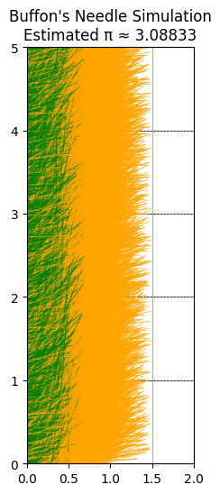
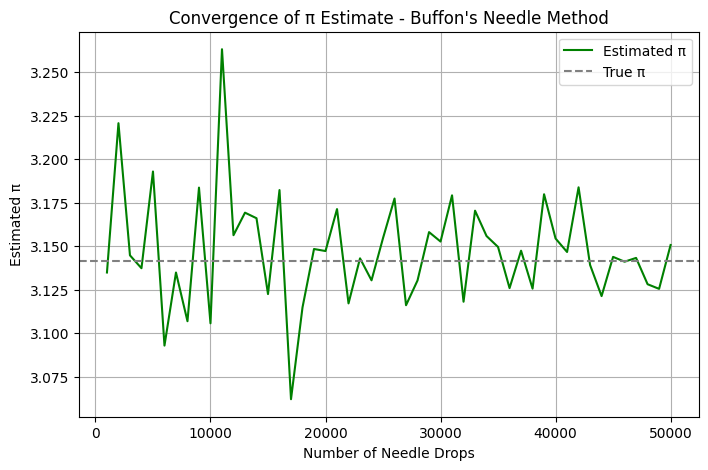

# Problem 2

# Estimating π Using Monte Carlo Methods

## Motivation

Monte Carlo simulations are a powerful computational tool that use randomness to solve complex problems. One elegant application of this technique is estimating the value of π through geometric probability. By randomly generating points and analyzing their distribution relative to geometric shapes, we can approximate π in a visual and intuitive way.

This approach not only connects core principles from probability, geometry, and numerical computation but also serves as an accessible entry point into the broader applications of Monte Carlo methods in physics, finance, and computer science.


## Part 1: Estimating π Using a Circle

### 1. Theoretical Foundation

To estimate π, consider a unit circle (radius = 1) inscribed within a square with side length 2. The area of the circle is:

$$
A_{\text{circle}} = \pi r^2 = \pi
$$

The area of the square is:

$$
A_{\text{square}} = (2)^2 = 4
$$

The ratio of the areas is:

$$
\frac{A_{\text{circle}}}{A_{\text{square}}} = \frac{\pi}{4}
$$

By generating random points uniformly within the square and checking how many fall inside the circle, we can estimate π using:

$$
\pi \approx 4 \cdot \frac{N_{\text{inside}}}{N_{\text{total}}}
$$

### 2. Simulation

* Generate `N` random (x, y) points in the square $[-1, 1] \times [-1, 1]$
* Count how many satisfy $x^2 + y^2 \leq 1$
* Estimate π with the above formula

```python
import numpy as np
import matplotlib.pyplot as plt

def estimate_pi_circle(num_points):
    x = np.random.uniform(-1, 1, num_points)
    y = np.random.uniform(-1, 1, num_points)
    inside = x**2 + y**2 <= 1
    pi_estimate = 4 * np.sum(inside) / num_points
    return pi_estimate, x, y, inside

# Generate points and estimate π
np.random.seed(42)
pi_estimate, x, y, inside = estimate_pi_circle(10000)

# Plot
plt.figure(figsize=(6, 6))
plt.scatter(x[inside], y[inside], color='blue', s=1, label='Inside Circle')
plt.scatter(x[~inside], y[~inside], color='red', s=1, label='Outside Circle')
plt.gca().set_aspect('equal')
plt.title(f'Circle-Based Monte Carlo\nEstimated π ≈ {pi_estimate:.5f}')
plt.legend()
plt.grid(True)
plt.show()
```

### 3. Visualization



### 4. Analysis

By increasing the number of random points, the estimate of π becomes more accurate due to the Law of Large Numbers. A plot of π estimates against the number of iterations can show how the estimate converges.

```python
def convergence_circle(max_points, step):
    estimates = []
    for n in range(step, max_points + 1, step):
        pi_estimate, _, _, _ = estimate_pi_circle(n)
        estimates.append((n, pi_estimate))
    return np.array(estimates)

# Convergence data
circle_convergence = convergence_circle(50000, 1000)

# Plot
plt.figure(figsize=(8, 5))
plt.plot(circle_convergence[:, 0], circle_convergence[:, 1], color='blue', label='Estimated π')
plt.axhline(y=np.pi, color='gray', linestyle='--', label='True π')
plt.title('Convergence of π Estimate - Circle-Based Method')
plt.xlabel('Number of Points')
plt.ylabel('Estimated π')
plt.grid(True)
plt.legend()
plt.show()
```




## Part 2: Estimating π Using Buffon’s Needle

### 1. Theoretical Foundation

Buffon’s Needle is a probability experiment where a needle of length $L$ is dropped on a plane with equally spaced parallel lines a distance $d$ apart. If $L \leq d$, the probability $P$ that the needle crosses a line is:

$$
P = \frac{2L}{\pi d}
$$

Rearranging to estimate π:

$$
\pi \approx \frac{2L \cdot N_{\text{total}}}{d \cdot N_{\text{cross}}}
$$

### 2. Simulation

* Set values for $L$ and $d$, with $L \leq d$
* Randomly drop needles by generating center points and angles
* Count the number of needles crossing a line
* Estimate π with the derived formula

```python
def estimate_pi_buffon(num_needles, needle_length=1.0, line_spacing=2.0):
    x_center = np.random.uniform(0, line_spacing / 2, num_needles)
    theta = np.random.uniform(0, np.pi / 2, num_needles)
    crosses = x_center <= (needle_length / 2) * np.sin(theta)
    pi_estimate = (2 * needle_length * num_needles) / (line_spacing * np.sum(crosses)) if np.sum(crosses) > 0 else np.nan
    return pi_estimate, x_center, theta, crosses

# Simulate and plot
np.random.seed(42)
pi_estimate, x_center, theta, crosses = estimate_pi_buffon(10000)
line_spacing = 2.0

plt.figure(figsize=(6, 6))
for i in range(6):
    plt.axhline(y=i, color='black', linestyle='--', linewidth=0.5)

for i in range(len(x_center)):
    y_center = np.random.uniform(0, 5)
    theta_i = theta[i]
    x1 = x_center[i] - (0.5 * np.cos(theta_i))
    x2 = x_center[i] + (0.5 * np.cos(theta_i))
    y1 = y_center - (0.5 * np.sin(theta_i))
    y2 = y_center + (0.5 * np.sin(theta_i))
    color = 'green' if crosses[i] else 'orange'
    plt.plot([x1, x2], [y1, y2], color=color, linewidth=0.5)

plt.xlim(0, line_spacing)
plt.ylim(0, 5)
plt.gca().set_aspect('equal')
plt.title(f"Buffon's Needle Simulation\nEstimated π ≈ {pi_estimate:.5f}")
plt.grid(True)
plt.show()
```

### 3. Visualization



### 4. Analysis

* Track how π estimation improves with more drops
* Compare convergence rate to the circle-based method
* Discuss limitations, such as sensitivity to small sample sizes and angular uniformity

```python
def convergence_buffon(max_needles, step, needle_length=1.0, line_spacing=2.0):
    estimates = []
    for n in range(step, max_needles + 1, step):
        pi_estimate, _, _, _ = estimate_pi_buffon(n, needle_length, line_spacing)
        estimates.append((n, pi_estimate))
    return np.array(estimates)

# Convergence data
buffon_convergence = convergence_buffon(50000, 1000)

# Plot
plt.figure(figsize=(8, 5))
plt.plot(buffon_convergence[:, 0], buffon_convergence[:, 1], color='green', label="Estimated π")
plt.axhline(y=np.pi, color='gray', linestyle='--', label='True π')
plt.title("Convergence of π Estimate - Buffon's Needle Method")
plt.xlabel('Number of Needle Drops')
plt.ylabel('Estimated π')
plt.grid(True)
plt.legend()
plt.show()
```



## Comparison and Conclusion

| Method          | Convergence Speed | Accuracy (at 100k samples) | Complexity | Notes                        |
| --------------- | ----------------- | -------------------------- | ---------- | ---------------------------- |
| Circle-Based    | Fast              | High                       | Low        | Simple geometry, robust      |
| Buffon’s Needle | Slower            | Moderate                   | Medium     | More sensitive to randomness |

### Summary

Both methods effectively demonstrate how Monte Carlo simulations can estimate π using randomness. While the circle-based approach tends to converge faster and more smoothly, Buffon’s Needle offers a historically significant and geometrically rich alternative. These simulations not only reinforce fundamental principles in mathematics and physics but also showcase the real-world applicability of probabilistic modeling.

